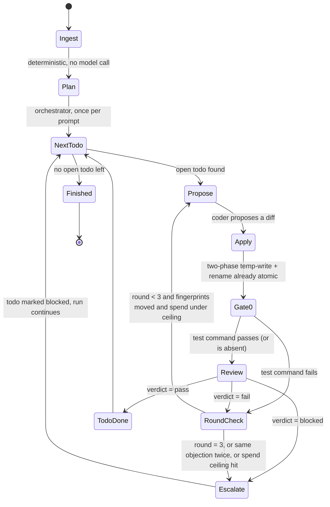

# Paider — Build Plan

Written 2026-08-02, immediately after `DECISIONS.md`. That log is the constraint set for
everything below — numbers are not re-derived here, only applied. Where this plan's own
research changed the picture `DECISIONS.md` assumed, that's called out explicitly rather than
smoothed over.

---

## Thesis

**Paider is a PHP-native coding-agent CLI built on Laravel Zero, differentiated by disciplined
scope and cost-aware model routing, not by being first.** Say the honest part up front: a direct
competitor already exists — [`neuron-core/maestro`](https://github.com/neuron-core/maestro)
(38★, PHP 8.4+, `composer global require neuron-core/maestro`, built on
[`neuron-core/neuron-ai`](https://github.com/neuron-core/neuron-ai), 2,038★, active) ships
today as an interactive, repo-aware, tool-approving, MCP-capable coding agent. Its own README
calls it "the first CLI agent built in PHP." That claim predates Paider by weeks, and it's a
real, working product, not vaporware — verified via its README, releases (tagged `2.0.0`,
2026-06-19), and composer.json. **The "no PHP coding-agent CLI exists" framing from the original
research prompt is false. Do not ship a README that says it.**

What's still true, and still worth building on:

- Maestro is 38 stars after months next to its own 2,038-star underlying SDK — the "PHP
  developers want an agent CLI in PHP" thesis is *unproven*, not confirmed, even by the one
  entrant that exists.
- Maestro is a single-maintainer project structurally coupled to a commercial upsell
  ([Inspector.dev](https://inspector.dev) observability SaaS is wired into its monitoring story)
  and sits on top of a pre-1.0 stack at every layer: `neuron-ai` itself, and transitively
  `modelcontextprotocol/php-sdk` (v0.7.0, explicitly "considered experimental" per its own
  README) if/when it uses MCP client features.
- Nobody in the PHP space — Maestro included, per its public docs — treats **model economics as
  a first-class, named feature**. Aider's own `main`/`weak`/`editor` split is unlabeled and its
  fork's aliases are 1–4 generations stale (`cecli`'s `haiku` still points at an October 2024
  model). Paider already ships `config/presets.php` with four *named* tiers
  (orchestrator/coder/research/fast), verified-live model IDs and prices, and a documented
  95.5%-cheaper default (Opus 5 orchestrates, qwen3.7-flash codes, deepseek-v4-flash researches) — that's built, not aspirational.
- Aider died from **scope creep and abandoned stewardship**, not from a technical flaw (see
  Risks). The single most-repeated complaint mined from its own issue tracker isn't a missing
  feature — it's "where is Paul?" (#4613) and "what is the intended future of Aider?" (#4648,
  closed not-planned by the maintainer). A PHP agent that is still being maintained a year from now
  beats a 48k-star original that is ten weeks dark. Note this is about
  *stewardship*, not velocity — Jeremy's objection to an earlier draft of this
  line was that "ships slower" is not the trade being made. He is not capacity
  constrained; the discipline is in scope, not in pace.

**The honest thesis, one sentence:** Paider bets that a narrowly-scoped, cost-routed,
Laravel-native PHP coding agent beats both a stalled 48k-star original and a 38-star PHP entrant
coupled to a SaaS pitch — not because PHP needed an agent, but because an agent that lives
*inside* a Laravel app knows things an external one has to be told, and because nobody has yet
shipped one that won't rot.

**Model routing is a named feature, not a config detail.** Eleven presets ship in
`config/presets.php`, every model ID and price verified live: eight single-provider stacks, a
`balanced` default (Opus 5 orchestrates, qwen3.7-flash codes, deepseek-v4-flash researches — 95.5%
cheaper than all-Opus), and two open-weight stacks for developers who will not send their code to a
US frontier lab: `open` on kimi-k3/k2.6 + deepseek-v4-flash, and `open-frugal` on minimax-m3 at
$0.30/$1.20 for a 1M-context orchestrator. That last constituency is real and entirely unserved in
PHP — which is exactly why the "open" label has to be exact. All four are confirmed downloadable,
and confirmed the right way: not from a model card promising weights, but from the HuggingFace API
reporting each repo public and ungated with real safetensors shards present (k2.6 64, v4-flash 46,
minimax-m3 59). k3 was checked 2026-08-02, the other three on 2026-08-03.

---

## Non-goals

Written to prevent the exact death aider had: 1,770 open issues and no commits in ten weeks.
Every one of these is a plausible, tempting feature. None of them ship in v1.0.

- **No web UI, no dashboard, no hosted service.** Terminal only. Maestro already pointed this at
  a commercial SaaS (Inspector); Paider does not compete on observability tooling.
- **No plugin marketplace.** An `ExtensionInterface` may exist internally (Maestro's pattern is
  worth studying), but there is no discovery/registry/store for third-party extensions in scope.
- **No multi-repo / multi-workspace orchestration.** One repo, one working directory, one
  session. If you need a monorepo tool, that's a v2+ conversation, not v1.
- **No auto-PR / GitHub-API integration.** Paider edits your working tree and commits locally.
  Opening PRs, managing CI, or talking to GitHub's API is out of scope indefinitely.
- **No support for every LLM provider on day one.** Only the presets already defined in
  `config/presets.php` — eleven of them: anthropic, openai, google, kimi, deepseek, xai, qwen,
  glm, `open`, `open-frugal`, balanced (the last two, both open-weight stacks, were added after
  this list was first written and are synced back here now) — plus a generic
  OpenRouter/OpenAI-compatible escape hatch. Provider requests get a `--base-url` override, not a
  bespoke integration.
- **No native Windows support — but the reason is narrower than it was.** ~~WSL only~~ The UI
  half of this non-goal is dead: `laravel/prompts` under a Laravel console kernel already falls
  back on Windows (Correction 3 below, measured). What remains is **POSIX shell tool execution** —
  Paider's tools shell out, and that is the same reason Maestro made this call. So the honest
  statement is "Windows is untested and the shell tools assume POSIX", not "the UI can't run
  there." Do not cite `laravel/prompts` as the blocker; that was wrong. Revisit if someone asks.
- **No multi-subscription rotation.** Explicitly parked in `DECISIONS.md` §5: a Claude Max seat
  cannot be spent through the API since 2026-06-15, which breaks the one case (Anthropic) where
  Jeremy personally holds multiple seats. `config/presets.php`'s `accounts` block stays inert
  until an actual user asks for it with real API-key rotation in mind, not subscription seats.
- **No autonomous/unattended multi-day agent loops.** Every tool call that touches the
  filesystem or shell is either interactive-approved or run inside an explicit, bounded
  `--yes`-gated non-interactive session (v0.2). No background daemons, no cron-triggered agents.
- **No custom editor/IDE integration.** aider's highest-reaction unshipped requests are VSCode
  (#68, 56 reactions), Emacs (#1913, 62), PyCharm (#483, 40) — all still open after years. Don't
  start a fourth front. If MCP-server mode (v1.0) lets Claude Code or another client drive
  Paider's tools, that's the integration story; a native plugin is not.

---

## v0.1 scope

The smallest thing that is genuinely useful, shippable solo, installed the way Maestro proved
PHP devs will actually install a CLI agent: `composer global require`.

**Binary:** `paider` (rename from the Laravel Zero default `application` entry point).

Commands:

- **`paider`** (bare, default) — starts an interactive chat session rooted at the current
  working directory. Loads a context file if present, checking in order: `PAIDER.md`,
  `CLAUDE.md`, `AGENTS.md` (matches the ecosystem convention Maestro and Claude Code both use —
  don't invent a fourth filename).
- **`paider chat`** — explicit alias of the bare command, for scripts/muscle memory.
- In-session slash commands (aider's proven UX, not a Paider invention):
  `/add <file>`, `/drop <file>`, `/diff`, `/undo`, `/tier <name> <model>` (session override of a
  tier), `/quit`.
- **`paider commit`** — stages the working tree, generates a commit message on the **fast**
  tier, runs `git commit`. This is the smallest standalone feature that's useful even outside a
  full agent session and a good "does the tier router actually work" smoke test.
- **`paider config:provider <preset>`** — writes the selected `config/presets.php` preset as the
  active provider stack into `.paider/settings.json` (mirrors Maestro's
  `.maestro/settings.json` pattern, same directory-scoping decision, no reason to diverge).
- **`paider config show`** — prints the resolved tier → model → price table for the active
  preset. This is a real feature, not a debug command: nobody else in this space surfaces "here
  is exactly what you're about to pay for each tier" before you start burning tokens.

Tools available to the agent loop in v0.1 (all native PHP, no MCP dependency yet — see
Architecture):

- Read file (`.gitignore`-aware, deny-list-guarded — see Architecture), write file (whole-file
  replace), patch file (unified diff apply, stamp-checked against the file at `/add` time, `php
  -l` checked after write — see Architecture)
- Run shell command — always behind an approval gate (allow-once / allow-session / deny), same
  three-state UX Maestro already validated
- `git diff`, `git add`, `git commit`
- **`ArtisanTool`** — present only when `artisan` exists at the repo root. One hardcoded call,
  `php artisan route:list --json`, exposed to the agent as a typed tool result (route, method,
  action) rather than raw shell text. This is the v0.1 proof of the Laravel-host thesis — see
  "Sequencing: the Laravel-host proof can't wait for v1.0" below.

**Explicitly deferred past v0.1:** MCP client/server support (Paider consuming or exposing tools
over the actual protocol), non-interactive `--yes` mode, repo-map/search tooling, automatic
test-runner feedback loop, and any *general* Artisan/job/model passthrough beyond the one
hardcoded `ArtisanTool` call above. All real, all v0.2+.

**Definition of done for v0.1:** Jeremy runs `composer global require` from a fresh machine,
points `paider` at a real repo, has it make a multi-file edit via the default `balanced` preset
(Opus 5 orchestrator, `qwen3.7-flash` coder), approves the diff, and commits — end to end, no
manual model wiring, no crash on a malformed diff from the coder tier, no silent apply against a
file that moved since `/add`, and no `.env` sent to a provider by accident. Pointed at a Laravel
repo, `ArtisanTool` is available and the agent can use it unprompted.

---

## Architecture

Laravel Zero is already scaffolded (`composer.json` pins `php: ^8.2`, `laravel-zero/framework:
^12.0.2`, Pest 3/4, Pint, Mockery; `box.json` exists for PHAR builds). Build inside that, don't
restructure it.

```
app/
  Commands/
    ChatCommand.php          # bare + `chat` — the REPL loop
    CommitCommand.php
    Config/
      ProviderCommand.php    # `config:provider <preset>`
      ShowCommand.php        # `config show`
  Agent/
    Session.php              # holds context files, chat history, active tier map
    TierRouter.php           # resolves (operation) -> (provider, model, tier) from config/presets.php + .paider/settings.json
    Loop.php                 # the actual think -> tool-call -> apply -> observe cycle
  Providers/
    Contracts/ProviderClient.php   # send(messages, tools, model) -> response
    AnthropicClient.php
    OpenAiCompatibleClient.php     # covers openai, kimi, deepseek, xai, qwen, glm, google via OpenRouter/base-url override
  Tools/
    Contracts/Tool.php
    ReadFileTool.php          # .gitignore + deny-list guard before any content leaves the process
    WriteFileTool.php
    PatchFileTool.php         # stamp check + in-process syntax gate before the diff is shown
    ShellTool.php             # wraps approval gate
    GitTool.php
    ArtisanTool.php           # v0.1 Laravel-host proof: one hardcoded call, see below
  Approval/
    Gate.php                  # allow-once / allow-session / deny, Termwind-rendered prompt
  Rendering/
    DiffRenderer.php           # Termwind
    ChatRenderer.php            # Termwind
config/
  presets.php   # already exists — do not rewrite, extend
  app.php, commands.php  # scaffolded defaults
```

**Provider layer — deliberately NOT `prism-php/prism`.** `prism-php/prism` (2,406★) last pushed
2026-03-20 — over four months stale with 114 open issues, per DECISIONS.md and this plan's own
verification. Taking a hard dependency on a stalling package to build a project whose entire
premise is *not dying of neglect* is a contradiction. `ProviderClient` is a ~150-line interface;
Anthropic and "OpenAI-compatible" (covers OpenRouter and every non-Anthropic preset in
`presets.php`, since they're all reachable through OpenRouter-shaped endpoints) cover every
preset with two implementations. If `prism-php` gets healthy again later, swap the
implementation behind the same interface — that's what the interface is for. Don't block v0.1 on
someone else's maintenance cadence.

**MCP layer — `modelcontextprotocol/php-sdk`, scoped narrowly.** Verified state as of 2026-08-02:
v0.7.0, last commit 2026-07-27, backed jointly by the PHP Foundation and Symfony (institutional,
not solo — lower abandonment risk than it looks from stars alone), both client and server
support implemented, stdio + HTTP/streamable-HTTP transports, protocol version 2025-11-25 (
current). It is genuinely absent from `modelcontextprotocol/conformance`'s `KNOWN_SDKS` — but so
is the official Swift SDK, so this tracks with "everything pre-1.0" rather than a PHP-specific
red flag. Known open bugs worth watching: #405 (tool-schema serialization), #398 (silent
discovery failure if `symfony/finder` missing), #399 (missing resource-link blocks), #381
(request-id correlation loss). None architecture-breaking.

Decision: **v0.1 does not depend on it.** Paider's own five tools (read/write/patch/shell/git)
are native PHP, not MCP tool handlers — MCP is an interop protocol for *external* tool servers,
and v0.1 has no external servers to interop with. v0.2 adds `php-sdk` as an **MCP client only**
(consume third-party MCP servers the way Maestro's `mcp_servers` config does). v1.0 adds **MCP
server mode** (Paider exposes its own tools to Claude Code or another client) — that's the point
where being on a pre-1.0 SDK matters most, so it's deliberately the last thing added, after the
SDK has had two more quarters to mature past 0.7.

**Tier router.** `TierRouter::resolve(string $operation): array{provider, model, tier}` reads
the active preset (default `balanced`) merged with any `.paider/settings.json` session
overrides from `/tier`. Four fixed operations map to the four fixed tiers — this mapping is
intentionally not configurable per-operation in v0.1 (that's a config-surface trap, not a
feature): `plan` → orchestrator, `edit` → coder, `search`/`summarize` → research, `commit-msg`
→ fast.

**`sk-sp-` guard, in v0.1.** Before any provider call goes out, the client construction path
checks the resolved key against the resolved base URL: if the key matches `sk-sp-*` (a Qwen
Coding Plan key, see "Qwen Coding Plan" below) and the base URL does not contain
`coding.dashscope`, refuse loudly instead of sending the request. A wrong-but-valid Model Studio
base URL silently bills pay-as-you-go against a plan key — a real surprise bill, cheap to catch
with one string check, no reason to wait for v0.2.

**structured_outputs=false mitigation, concretely.** The default coder is `qwen/qwen3.7-flash`,
which reports `structured_outputs=false` (per `config/presets.php`'s own comment and
DECISIONS.md §4). `PatchFileTool` therefore never trusts a JSON tool-call payload for diff
content — it asks the coder tier for a fenced unified-diff block in prompt text, parses it with a
strict parser, and on parse failure retries once with an explicit "your last diff didn't parse,
here's why" message before escalating to the orchestrator tier to author the patch directly. This
needs a real test fixture set (malformed hunks, missing context lines, mixed line endings) before
v0.1 ships, not after a corrupted file is the bug report.

**Diff-apply staleness — the failure the parse-retry above doesn't cover.** Aider's own
post-mortem ([#3895](https://github.com/Aider-AI/aider/issues/3895)) names *context/state
mismatch* — a syntactically valid diff whose context lines no longer match because the file
changed after the model read it — as the largest failure bucket, bigger than parse failure.
Concretely: `/add <file>` stamps the file with a content hash at the moment it enters context,
held in `Session.php` alongside the chat history. Before `PatchFileTool` (or `WriteFileTool`)
writes, it re-hashes the file on disk; if the hash has moved since the stamp, it refuses to apply
and surfaces a conflict to the user (file changed since `/add` — re-add it or discard the pending
edit) instead of writing over an edit the model never saw. **Multi-file apply is all-or-nothing**,
for free: every file in one apply pass writes to its temp path first (the same atomic
write-then-rename primitive already chosen for interrupt safety, see EXTENSIONS.md), and the
renames only happen once every temp write and every stamp check in the batch has succeeded — one
bad file fails the whole apply, nothing partially lands.

**Syntax gate before the write lands — in-process, no subprocess.** One more layer on the same
risk: `PatchFileTool` runs `token_get_all($content, TOKEN_PARSE)` in a try/catch against the
patched content of any `.php` file and fails the apply on `ParseError`, so a syntactically broken
patch never reaches disk at all. A syntax error is treated exactly like a parse failure upstream —
nothing is written, and the coder tier gets one retry with the error before escalating to the
orchestrator. This directly targets the `structured_outputs=false` risk on the default coder
(`qwen3.7-flash`): it catches the case where the diff parsed cleanly but produced invalid PHP,
which the diff parser alone cannot see.

> **Corrected 2026-08-02.** This section previously specified shelling out to `php -l` after the
> write, then reverting via the undo stack. That was never implemented and could not have been:
> `php -l` does not exist under the FrankenPHP static binary (its flag parser is Caddy's) and
> `PHP_BINARY` is the empty string there, so there is no interpreter to shell to. The in-process
> check is strictly better anyway — it runs *before* the write rather than after, so there is
> nothing to revert.
>
> Leaving the wrong version in this file had a real cost: a later design pass read it, believed
> it, and specified a review gate built on `php -l`. An adversarial reviewer caught that. Prose
> that describes code which does not exist is not merely stale — it is an instruction to build
> the wrong thing.

**`/undo`, designed.** It undoes the single most recently *applied* file write (whole-file or
patch) — not a turn, not a commit. `Session.php` keeps an in-memory stack of `{path, previous
bytes | null}` entries, pushed immediately before each atomic write (`null` previous means the
file didn't exist and `/undo` deletes it). `/undo` pops one entry and atomically restores it;
repeated `/undo` walks back further, one applied write at a time. It is **not git-backed** — v0.1
has no persistence layer yet (`pdo_sqlite` is v0.2, see EXTENSIONS.md), and inventing one just for
undo would be a config-surface trap for a command whose job is "get me back to before that last
edit." It is also **deliberately disconnected from `paider commit`**: undo only ever touches the
uncommitted working tree; once `commit` runs, those changes are git history and get rolled back
with ordinary git tooling (`git revert` / `git reset`), not `/undo`. If the working tree has moved
out from under the undo stack (the user hand-edited a file between an apply and an `/undo`), it
refuses and surfaces a conflict — the same stamp-mismatch path as diff-apply staleness above,
since both are "the file changed under us."

**Secrets read-guard.** Nothing currently stops `ReadFileTool` from handing `.env` or a private
key to a provider as context. Before returning file content, `ReadFileTool` checks the path
against two things: `git check-ignore <path>` (git is already a hard dependency via `GitTool`, so
this is zero new code and zero new extensions — no reason to hand-roll a `.gitignore` parser) and
a small hardcoded deny-list for the things people forget to `.gitignore` in the first place
(`.env`, `.env.*`, `*.pem`, `*.key`, `id_rsa*`, `*.p12`, `.aws/credentials`). A match refuses by
default and routes through the same Approval Gate as `ShellTool` — allow-once if the user really
means to send it, not a silent send.

**`ArtisanTool` — the v0.1 Laravel-host proof.** See "Sequencing" below for why this exists in
v0.1 at all rather than waiting for MCP server mode. It is intentionally the smallest possible
version of the claim: registered only when `artisan` exists at the repo root, it exposes exactly
one call — `php artisan route:list --json`, parsed into a typed tool result — not a general
Artisan passthrough (`ShellTool` already covers "run anything," approval-gated) and not job
dispatch or model introspection (both mutate state or need schema access this proof doesn't). The
point is narrow on purpose: prove the agent's tool surface can speak a Laravel-native concept
instead of only generic files and shell text, in v0.1, not in a v1.0 that hasn't shipped yet.

**Rendering/UX:** Termwind for diff coloring, tool-approval prompts, and the chat transcript —
already in the ecosystem's toolbox (2,492★, "Tailwind for terminal"), no reason to hand-roll
ANSI. **Testing:** Pest, already scaffolded, tagline literally targets this use case ("for PHP
developers and AI agents"). **Errors:** Collision, Laravel Zero default, keep it.

**Distribution.** ⚠️ **Superseded — see "Distribution and concurrency" below: PHAR is cut.** Left
here, unmarked-until-now, exactly per this project's convention of keeping wrong turns visible
rather than silently deleting them. Original text, for the record: "`box.json` already exists —
v0.1 ships as a PHAR via Box, installed through `composer global require` (proven install path,
matches Maestro exactly, zero reason to diverge from what already works for this exact audience).
Per DECISIONS.md §3, a shipped PHAR must not inherit a dev machine's 76-extension ini (94ms of the
143ms measured overhead) — pin the extension list in the Box build config. `static-php-cli`
/FrankenPHP static-binary distribution is a v0.2+ upgrade for users who don't want PHP installed
at all, not a v0.1 requirement." That is no longer the plan — PHAR needs PHP installed but isn't a
composer dependency, so it loses to both channels decided later in this document.

---

## Sequencing: the Laravel-host proof can't wait for v1.0

As originally milestoned, v0.1 was a standalone CLI — "Maestro, done more carefully" — while the
README called the Laravel-host angle "the thesis" and MCP *server* mode (the mechanism that would
actually make it true) sat in v1.0. That means through the entire v0.1–v0.2 window, exactly when
early adopters form an opinion of what Paider is, the stated differentiator would not exist yet.
That's backwards: a reader who tries v0.1 and finds a competent-but-generic CLI, then reads a
README calling it "the thesis," reasonably concludes the README is marketing ahead of the product
— which is the same credibility problem this project is explicitly trying not to have with the
"first PHP coding agent" claim (see Thesis).

The fix is not to build MCP server mode early — the SDK-maturity reasoning for parking that at
v1.0 (see Architecture) still holds, and pulling it forward would reintroduce the exact
pre-1.0-dependency risk it was sequenced to avoid. The fix is to ship a **token-sized proof of the
shape**, not the mechanism: `ArtisanTool` (see Architecture), one hardcoded call exposing a real
Laravel-host artifact (`route:list`) as a typed tool rather than generic shell text. It costs one
small file and doesn't touch MCP, the SDK, or the package-vs-binary distribution question at all
— Paider is still installed and run exactly as v0.1 already specifies (`composer global require`,
pointed at a repo). It proves the narrower, load-bearing half of the claim — *the tool surface can
speak Laravel's own idiom* — while the fuller claim (*any client can drive those tools over MCP*)
stays exactly where it was, in v1.0, now visibly building on a working v0.1 example instead of
starting from zero.

This displaces nothing from Non-goals: it is not a plugin marketplace, not multi-repo, not a new
provider, and it is explicitly *not* general Artisan/job/model access (that stays v0.2+, gated the
same way the rest of the tool surface is). One file, one hardcoded call, shipped now instead of
promised later.

---

## Milestones

**🔨 M1 — "it works on my repo"** — *in progress.*

> **Naming, so two different things stop sharing a label.** The **v0.1.0 tag** is a release
> number: it exists, it is on Packagist, and it means "the package installs and the commands
> work." **M1** is a capability milestone and is NOT met — nobody has yet watched Paider drive
> an end-to-end multi-file edit in a repo that is not this one. Cutting the tag did not close
> the milestone, and the milestone closing will not require a new tag name. They were called
> the same thing, which made "is v0.1 done?" unanswerable.

*Shipped: five commands, six native tools, the approval gate, PathGuard and SecretsGuard, the
append-only event log, and a cost ledger that reports real money and reconciles against
provider-reported usage. CI runs the hermetic suite on PHP 8.4 and 8.5. Rehearsal infrastructure:
`m1/` directory with `preflight.sh`, `TASK.md`, `RUNBOOK.md` speedup script and fixture. `install.sh`
✅ **live** at paider.dev (composer-only, served from GitHub Pages). `design/` directory with 18 terminal captures
and TUI-REVIEW.md findings (proposals, not applied). Still open for M1: the end-to-end edit in
someone else's repo, and the FrankenPHP binary embed step.*

**⬜ v0.2 — "it doesn't need me watching it"** — *planned.*
- MCP client support via `modelcontextprotocol/php-sdk` (consume external tool servers)
- `paider run "<prompt>" --yes` — bounded non-interactive mode for scripting/CI, with an
  explicit allow-list of tools it may auto-approve (never unrestricted)
- Repo-map/search tool on the research tier (cheap, high-volume, exactly the tier DECISIONS.md
  named for this)
- Automatic test-runner feedback loop: after an applied edit, run a configured test command,
  feed failures back to the coder tier for N bounded retries
- `.paider/` directory consolidation, XDG-respecting config location — directly answers aider's
  own oldest unresolved high-reaction issue (#216, 79 reactions: "config file location should
  follow modern specifications") and #2860 (26 reactions, scattered dotfiles)
- Definition of done: a CI job can run `paider run` against a failing test and get a passing
  commit without a human in the loop, bounded by a retry cap and a tool allow-list.

**⬜ v1.0 — "safe to depend on"** — *planned.*
- MCP **server** mode: generalizes v0.1's single hardcoded `ArtisanTool` into the real thing —
  Paider exposes its own read/write/patch/shell/git/Artisan tools, and arbitrary host-app jobs and
  models, to external MCP clients (Claude Code, others) over the actual protocol — dogfoods
  `php-sdk` in both directions
- Published semver policy and an explicit, versioned non-goals doc shipped alongside the release
  (the direct antidote to aider's death: state what will never be added, in writing, so scope
  requests have a citable "no")
- Measured, published diff-apply success rate on the default coder tier (qwen3.7-flash) across a
  fixture corpus — turns the structured_outputs risk from a comment in a config file into a
  tracked number with a regression gate in CI
- `static-php-cli`/FrankenPHP static binary hardened into a real release artifact (it's already
  one of the two decided channels — see "Distribution and concurrency" — this bullet originally
  said "alongside the PHAR," which no longer exists; left corrected rather than silently rewritten
  elsewhere)
- Definition of done: Paider has shipped at least one release per quarter for a year with no
  unaddressed critical (data-loss-class) bug open longer than two weeks — the "didn't die"
  criterion, since that's the actual differentiator being bet on.

**⬜ POST-1.0 — Paider's own benchmark suites** — *idea, recorded 2026-08-03. Not scoped, not
scheduled, and deliberately not in v1.0.*

> ### Mission
>
> **The industry needs a long-standing, INDEPENDENT, reliable source of truth, and does not have one.** Every
> few months a benchmark arrives, gets adopted, gets saturated, and is replaced by its own authors —
> and the replacement cadence is presented as rigour rather than as the decay it is. The result is
> that there is no stable ruler. You cannot ask "is this year's model actually better than the one
> two years ago, on the same measure, measured the same way" and get an answer anyone trusts. That
> is a strange gap in a field that talks about progress constantly.
>
> **Most benchmarks die the moment they start to matter.** Publishing the items buys adoption and
> spends the very thing that made the number worth citing: within a release cycle the score stops
> measuring capability and starts measuring exposure to the benchmark — and everyone goes on
> quoting it anyway. Keeping the items private preserves the measurement and buys nothing, because
> a number nobody can see is a number nobody uses.
>
> The Paider 100 takes that trade apart instead of picking a side. **Exposure comes from the score
> and the findings. Contamination comes from the items.** So we publish the score loudly, publish
> every run behind it — errors, timeouts and refusals included and tagged — publish what each run
> discovered and what it actually fixed, and never publish the items.
>
> **The methodology is a gift to the commons. The items are not.** Everything about *how* a bench
> is built gets published in full — task design, scoring rules, run counts, rotation schedule, the
> reasoning behind every judgement call, and the mistakes that shaped it. That is the part with
> transferable value, and withholding it would be hoarding, not protecting.
>
> The items stay private for one reason: publishing them produces exactly one more dead benchmark.
> Publishing the method lets anyone build their own hundred — and theirs stays valid *because it is
> theirs*. One shared item set decays for everyone who uses it; one shared methodology compounds for
> everyone who applies it. The open-source community is better served by a recipe than by a meal
> that spoils the moment it is served.
>
> **Independence is the whole credential.** A benchmark run by a lab measuring its own models has
> an obvious conflict, and no amount of methodology fixes it. Paider has no model to sell and no
> lab to flatter. It routes to all of them, and its cost ledger
> means a wrong routing decision costs its own users real money — so the incentive points at
> accuracy rather than at any particular model winning. That is not a claim of virtue; it is a
> structural fact about where the pressure comes from, and it is the only credential that matters.
>
> The commitment that makes it checkable: **when the Paider 100 says Paider's own default preset is
> the wrong choice, that gets published too.** A source of truth that has never embarrassed its
> author has not yet been tested.
>
> The promise is not that our number is unimpeachable. It is that it will still mean the same
> thing in two years — and "long-standing" is a claim only time can settle. It is earned by being
> boring for years: same items, same scoring, same methodology, mistakes published, nothing quietly
> retuned when a result is inconvenient.

**The worked example, checked 2026-08-03.** ARC-AGI-3: Claude Opus 5 scores 30.2%, Fable-class
models ~20%, GPT-5.6 Sol (Max) 7.8% ([ARC Prize](https://arcprize.org/results/anthropic-claude-opus-5)).
Opus 5 also takes 90.4% on ARC-AGI-2 and 97.5% on ARC-AGI-1. A 1.5x lead over a sibling that is
otherwise no weaker is the shape that should prompt a question — and the coverage answers it:
the benchmark was public before Opus 5 was developed, and *"independent testing on an alternative
puzzle benchmark showed narrower gains, suggesting the large ARC-AGI-3 advantage may reflect
specialized optimization for that specific benchmark format"*
([The Decoder](https://the-decoder.com/anthropics-opus-5-blows-past-fable-5-and-gpt-5-6-sol-on-the-benchmark-designed-to-measure-real-intelligence/)).

The full ARC-AGI-3 board makes the shape clearer, and also complicates it honestly. Opus 5
30.16%, Fable 5 16.6%, GPT-5.6 Sol 7.78%, **Opus 4.8 1.52%**, and nine of twelve listed systems
under 1% ([BenchLM](https://benchlm.ai/benchmarks/arcagi3)). The eye-catching number is not Opus 5
against its sibling — it is Opus 4.8 to Opus 5, **1.52% to 30.16%**, with the whole 4.x line
beneath 2%.

That gap is widely characterised as a "20x jump". Quoting it that way here is deliberate: it is
how the result travels in practice, and it is exactly the framing the publishing constraints below
forbid for our own scores. A multiple taken against 1.52% is meaningless — by the same arithmetic
Opus 4.6 (0.51%) is "2.8x" its own successor Opus 4.7 (0.18%). The multiple is quoted to be
criticised, not adopted.

**That discontinuity is not itself evidence of gaming, and it is worth being precise about why.**
ARC-AGI-3 is interactive: an environment is completed or it is not. Below some capability floor
everything piles up near zero because nothing can be finished, and crossing that floor produces a
leap. Nine of twelve systems under 1% is the signature of a floor effect, not of a smooth curve.
A threshold story and a benchmaxxing story predict the same jump, so the jump cannot distinguish
them.

**What discriminates is the independent cross-check** — the alternative puzzle benchmark on which
the same models showed narrower gains. A genuine threshold effect reproduces across comparable
benchmarks; optimisation for one format does not. That single independent measurement carries more
information than the entire public leaderboard it sits beside.

Same models, different ruler, different answer. That is the entire argument for a private item
set in one data point: the public number could not distinguish capability from exposure, and an
independent one could. The correct read is also the unexciting one — Opus 5 genuinely leads, and
not by the magnitude the headline number implies. Both halves are true, and no public benchmark
can tell you which part is which.

### Rotation and fairness — two rules that pull against each other

**Items change on an unpredictable schedule, and the schedule is never published.** Not quarterly,
not on release days, not on any cadence anyone can plan around. A known rotation date is a
training deadline; an unknown one cannot be optimised toward. Even internally the schedule is
decided late rather than committed to in advance, because a calendar that exists can leak.

**Within any single published round, every model gets byte-identical items and byte-identical
prompts.** Rotation is what keeps the ruler honest over years; identical conditions are what make
a comparison valid at all. Vary the items *between* rounds and never *within* one.

This means a score is always attributable to a specific round, and cross-round comparison is
reported with that caveat visible — including the old-vs-new gap on rotated items, which is the
contamination measurement described below. A model that scores well on rotated-in items it has
never seen has demonstrated something. A model that only scores well on the older set has
demonstrated something too, and the suite should say so out loud.

Build our own evaluation harnesses rather than routing model choices off other people's leaderboards.

| bench | measures |
|---|---|
| orchestration | can a model decompose a real task into todos another model can execute |
| code review | findings that **survive independent verification** — see the caveat below |
| agentic coding | end-to-end: prompt in, working tested diff out |
| vending-type | long-horizon economic agency; does it stay coherent over hundreds of turns |
| math | arithmetic and proof-shaped reasoning |
| unique style | can it hold a specified voice under pressure, not regress to house tone |
| image recognition | multimodal grounding |
| ARC-AGI variant | our own twist — the public one gets reinvented roughly monthly, so a fixed private variant is worth more than chasing it |

Plus a **prompt tester per bench**: the prompt is a variable under test, not a constant. Most
published comparisons hold the prompt fixed and vary the model, which measures "model + whoever
wrote that prompt" and reports it as the model.

**Why this is worth building rather than reading someone else's chart.** The Kilo Code Reviewer
benchmark (10,643 runs, 2026-06-22 → 07-23) ranks 13 reviewer routes by *critical findings per
completed review*: Kimi K2.7 Code 0.179, Grok 4.5 0.176, Laguna M.1 0.171, Sonnet 5 0.079,
Opus 4.8 0.019 — a 9x spread, with open weights taking two of the top three. Genuinely useful
signal, and exactly the job this plan's Adversarial Reviewer does.

But the metric counts findings **reported**, not findings **correct** — so a noisier model scores
higher by construction. This project has direct evidence the distinction is real: the 2026-08-03
audits found 6 security defects and 11 money-path defects, and each one only counted because two
independent skeptics had to reproduce it first. Several were refuted outright. A leaderboard
built on raw finding-count would have ranked the refuted ones as wins.

Paider already has the machinery to measure the honest version: the tier router picks the model,
the event log records every call, and the cost ledger prices it. A bench that reports
**verified-findings-per-dollar** is a number nobody else publishes, and it is the number that
should actually pick a tier.

### ⬜ The Paider 100

A single score out of 100, backed by **100 individually authored tests** — inspired by existing
benchmarks, never cloned from them.

**"Inspired, not cloned" is a contamination requirement, not a style preference.** A copied item
carries the contamination of its original: if an item is lifted from ARC-AGI, every model already
trained on ARC-AGI has effectively seen it, and the item measures recall rather than capability
on day one. Authoring fresh items in the same *shape* is the only way to keep the shape's
diagnostic value without inheriting its exposure.

100 is chosen deliberately: small enough that every item can be hand-built and argued over,
large enough that a single lucky or unlucky item moves the score by one point, and legible —
"Paider 100: 62" needs no explanation to be cited.

Roughly a dozen items per category across the eight benches above, weighted by how much each
category actually predicts real agent usefulness rather than split evenly for symmetry.

### The tension this is designed around

Every benchmark author faces the same trade and most pick a side by default rather than on purpose:

| | publish everything | publish nothing |
|---|---|---|
| exposure | high — adopted and cited fast | none — nobody knows it exists |
| lifespan | **short** — becomes a training target, then a marketing number | long |
| credibility | decays with the score's meaning | high, but unverifiable and unread |

Publishing everything buys adoption and spends validity. Publishing nothing preserves validity
and buys nothing. **The resolution is that these are separable: exposure comes from the score and
the findings, contamination comes from the items.** So publish the first two loudly and withhold
the third — which is exactly the policy below.

That split is what makes the Paider 100 worth maintaining for years rather than months. A number
people cite, findings people can check against real diffs, and an item set that never becomes
training data. The rotation policy below is the backstop: even partial leakage shows up as a
measurable old-vs-new gap rather than silently inflating the score.

### Publishing constraints — the number must resist misreading, not carry a disclaimer

A caveat in a methodology document protects the author. It does not protect the reader, because
the reader never sees it — the headline number travels alone, and people take numbers literally,
which is what numbers are for. **So these are constraints on what may be published, not guidance
on how to interpret what is published.**

**1. The interval is part of the number. Always, everywhere, inseparably.**
Never `62`. Always `62 ± 4`. A bare total is never published in any medium, because a bare total
is the thing that gets divided. If the interval is inconvenient to render, that is a reason to
fix the rendering, not to drop the interval.

**2. Precision is capped at what the measurement supports.**
`30.16%` is four significant figures on a quantity whose uncertainty exceeds most of the
leaderboard beneath it. Publishing that precision *is* the misleading act — it happens before
anyone divides anything, and it signals a confidence the data does not contain. If it is 30 ± 6,
it prints as `30 ± 6`.

**3. The per-category breakdown ships with the total, never after it.**
A single number for eight very different capabilities lets one saturated category carry the
headline. The breakdown is not an appendix; it is part of the result.

**4. Comparisons are published as item counts, never as multiples.**
Not "1.8x better." Not "20x." **"Passed 62 of 100 vs 48 of 100."** The unit shapes the
misreading: item counts invite subtraction — *14 more items* — which is true and stays true.
Multiples invite division, and a ratio taken near a floor is meaningless (Opus 4.6 at 0.51% is
"2.8x" its own successor Opus 4.7 at 0.18%, which is obviously nonsense). We will not publish a
multiple, and we will not publish a chart whose visual encoding implies one.

**5. Near-floor and near-ceiling results are reported as a band, not a value.**
Below the level where the suite can discriminate, the honest output is "did not clear the floor",
not a decimal. Three consecutive scores of 0.51%, 0.18% and 1.52% are not a capability gradient —
they are three ways of writing "completed almost nothing", and printing them as distinct numbers
manufactures a trend that is not there.

**Why these are constraints and not suggestions:** every one of them costs us headline impact.
An interval is less quotable than a point estimate, item counts are less dramatic than multiples,
and "did not clear the floor" makes a worse chart than 0.18%. That cost is the point. A number
designed to survive being quoted out of context is a different artefact from a number designed to
be quoted.

### The framing attack — and why publishing the number is not enough

A clean item set and honest intervals still leave one surface undefended: **presentation**. A lab
does not need to touch the benchmark to win with it. It needs a slide. Linear gains become
"exponential", a truncated y-axis turns +9 items into a vertical wall, a log scale flatters
whoever is furthest right, and a relative percentage ("29% better!") is technically true and
completely uninformative about magnitude.

This is not a moral failing on the labs' part — they are obliged to market, and every one of them
will present a favourable result favourably. **The defence is not to ask them not to. It is to make
the honest reading the more citable one, and to publish it first.**

**We characterise the trend ourselves, in the primary source.** Every publication states the shape
of the gain explicitly and quantitatively: *"generation N to N+1: +9 items (95% CI 5–13),
consistent with +7, +11 and +8 across the prior three generations — linear."* A lab claiming an
exponential leap is then contradicted not by an opinion but by the source it is citing, in wording
that predates its slide. Saying nothing about shape leaves the shape claim to whoever speaks
loudest.

**The canonical chart is ours, and it is boring on purpose.** Zero-based linear axis, intervals
drawn, all generations shown including the flat ones. Published as an image and as the data that
generated it, so anyone can reproduce it exactly. A lab is free to redraw it; the redraw is then
visibly a redraw.

**Deltas are published alongside levels**, because linear-versus-exponential is a claim about
deltas, not levels. A table of per-generation item-count changes makes the shape legible without
anyone needing to fit a curve.

**Machine-readable results ship with every round** — every score, interval, per-category
breakdown and per-run outcome, in a stable format. Anyone can regenerate the honest chart in
minutes. Making the truthful version trivially cheap to produce is more effective than any
licence term.

**Corrections are a standing practice, not a grievance.** When a published claim materially
misrepresents a Paider 100 result, we publish the side-by-side: their framing, our numbers, no
adjectives. Dated, in a permanent log. This is the one place where being an independent
non-participant has teeth — we have no model to defend and no partnership to protect, so the
correction costs us nothing to make.

### Publication policy — decided up front, because it is the whole design

**Publish every run, including the errored ones, tagged as such.** Crashes, timeouts, refusals,
malformed tool calls and API failures are results. A suite that reports only completed runs is
measuring "how good is this model on the subset of tasks where it did not fall over", which is
the number least useful to someone choosing a model. Error rate under load is often the
differentiator, and it is exactly what selective publication hides.

**Publish what each run discovered and what got fixed.** A finding that led to a real fix is
worth more than a score, and it is checkable — anyone can read the resulting diff. This also
keeps the suite honest about the verified-vs-reported distinction above: a "finding" with no
fix and no refutation is neither.

**Publish findings and results. Do NOT publish the bench code or the items.** Once a benchmark's
contents are public they become training data and an optimisation target, and the score stops
measuring capability and starts measuring exposure to that benchmark. Every widely-published
eval decays this way; withholding the items is the only cheap defence.

**The honest cost of that, stated plainly:** a held-back suite is *not independently
reproducible*. Nobody can rerun it to check us, so the results are worth exactly what our
methodology and track record are worth. That is a real trade, not a free win, and pretending
otherwise would be the same dishonesty this project keeps designing against. Mitigations that
keep most of the value:

- Publish the **methodology** in full — task shapes, scoring rules, run counts, dates, model
  versions and routes — everything except the items themselves.
- Publish **per-run traces** with the item redacted, so the reasoning and failure mode are
  visible even when the prompt is not.
- **Open the door, never the wire.** Anyone is invited on site to inspect everything: the items,
  the harness, the raw runs, the scoring code, the rotation log. Full transparency in person, to
  anyone who asks. **Nothing is ever disclosed over the internet** — no NDA'd downloads, no
  "trusted partner" API, no encrypted archive with a key emailed separately. Every remote
  disclosure mechanism eventually leaks, and one leak is permanent: an item that reaches a
  training corpus cannot be recalled.

  **Visitors sign an NDA covering the techniques and the items — never their findings or their
  opinions.** The protected thing is the *contents*: item text, generation methods, scoring
  internals, the rotation mechanism. What a visitor concluded is theirs, unconditionally, and
  they may publish it anywhere, in any tone, including "I went, I looked, and I am not convinced."

  That carve-out is not generosity, it is the entire point. An NDA that could silence a critic
  would make the visit worthless as evidence — a verification nobody is permitted to fail is not a
  verification. **A visitor's freedom to publish "this is sloppy" is precisely what makes their
  publishing "this is rigorous" worth anything.** Any agreement that does not preserve that has
  bought silence and called it trust.

  This is the honest answer to "then how do we know you are not making it up." You come and look.
  It is a real verification path, and a deliberately inconvenient one — inconvenience is the
  security property, not a side effect.

  **State its limits plainly, because they are real:** it privileges people who can travel, it
  does not scale, and a visitor's report is only worth that visitor's own credibility. It is
  strictly weaker than "download it and rerun it yourself." It is also strictly stronger than
  every private benchmark that offers no verification path at all, and it is the only design
  where the audit trail and the item set can both survive.
- **Rotate a held-out slice** every publication and report scores on old-vs-new items separately.
  If a model's score on rotated-in items is materially lower than on older ones, that gap IS the
  contamination measurement — publish it.
- Timestamp and version every run, so a result is always attributable to a specific model
  snapshot rather than a moving alias.

**Scope discipline:** this is a separate product, not a Paider feature. If it ships it ships as
its own repo. Recorded here so the idea survives, not so it creeps into v1.0.

---

## ⬜ v0.2 — Multi-agent roster, decided

*Planned. Banked here from a scratchpad design session so it survives past the terminal it was
written in — three roles, one executor, a bounded review loop. Corrected against three criticals
an adversarial pass found in the original draft (§"Three criticals, fixed as design" below) and
reconciled line-for-line against the code that actually shipped in **M1**, not the code the
original draft assumed would exist. Where the two disagreed, the shipped code won.*

### The roster: three roles, one executor

Five roles were proposed. Three survive — the other two were never agents, they were a routing
rule and a function wearing an agent costume.

| proposed role | verdict | what it became | why |
|---|---|---|---|
| **Orchestrator** | keep | a config row | one call per user prompt, plus rare arbitration. Low volume, high leverage — if it starts narrating the loop it's being over-used. |
| **Coder** | keep | a config row | the only role with `writes: true`. The only actor with disk access. |
| **Adversarial Reviewer** | keep | a config row, no write tools | earned, not assumed — see below. |
| Researcher | **deleted → tool** | `research(question)`, stateless, ≤2k-token reply | it has no memory, no plan, nothing to hand off. That's a function signature, not a role. Callable by all three, fanned out over Fibers + `curl_multi` (already the concurrency decision above), which makes it the one place in the loop that's actually parallel. |
| Documentor | **deleted → routing rule** | `TierRouter::forTodo()` sends docs-shaped todos to the `research` tier | "route docs to cheap models" is a `match` arm, not a fifth prompt file to maintain and drift out of sync with the other four. |
| Ingestor | **deleted → deterministic function** | `Ingest::rank()` — git-log recency, zero model calls | identical output every run; a model call here would be pure cost with no judgment being exercised. |

**Empirical case for keeping the Reviewer, not a slogan:** in this project, adversarial review
(not code review — a pass with an explicit mandate to find a reason the code is wrong) caught an
arbitrary-code-execution hole (`786a347`) that had shipped through a fully green 144-test suite —
`Loop::dispatchArtisan()`/`dispatchShell()` trusted an `approval` key if the *model's own tool-call
input* supplied one, and `systemInstruction()` had just told the model that field's name and
accepted values in the same prompt. Days later, a second adversarial pass aimed at `paider cost`
— the product's flagship, checkable claim — found 11 real defects, two of which made it print a
wrong dollar figure with no caveat (`ModelPricing::costFor()` returning `0.0` instead of `null` on
an unparsed usage block; `CostComparison` null-guarding `saved_usd` but not `spend_share_pct`, so a
de-listed model could print "99.9% of your tokens went through tiers costing 0.0% of your spend" —
the exact silent-zero framing the ledger exists to prevent). Both times the finder read the code
that ran, not the author's summary of what it was supposed to do. That is what "no write tools" is
for: a Reviewer that can "just fix it" stops reading for the failure and starts rationalizing past
it, which is the coder's job already and doesn't need a second seat.

Roles are **config rows against one executor**, not classes — introduce a class per role only when
a role needs behavior a row can't express (per-role retry policy, per-role tool guards beyond a
list). Nothing proposed for v0.2 needs that yet.

```php
// config/agents.php (v0.2, illustrative — not yet in the tree)
return [
    'orchestrator' => ['tier' => 'orchestrator', 'tools' => ['research'],                          'writes' => false],
    'coder'        => ['tier' => null /* TierRouter::forTodo() */, 'tools' => [
        'read_file', 'write_file', 'patch_file', 'run_shell', 'git', 'artisan', 'research',
    ], 'writes' => true],
    'reviewer'     => ['tier' => 'orchestrator', 'tools' => ['read_file', 'research'],              'writes' => false],
];
```

Six native tools ship today (`read_file`, `write_file`, `patch_file`, `run_shell`, `git`,
`artisan` — `app/Tools/*Tool.php`), not the five the Architecture section's tree comment still
says; `research` above is the new v0.2 tool, and an `mcp` tool joins the coder's list once the
`mcp/sdk` client lands (already scoped to v0.2 in this Milestones section — no change here, just
confirming the roster composes with it).

### Tier assignment

| role / call | tier | model class | rationale |
|---|---|---|---|
| orchestrator — plan | `orchestrator` | Opus-5-class | exactly one call per user prompt |
| orchestrator — escalation arbitration | `orchestrator` | Opus-5-class | rare by construction (the cap trips before this fires often) |
| coder — code todo | `coder` | Sonnet-class (default) | holds a schema, runs in a loop where latency compounds |
| coder — docs todo | `research` | Haiku/flash-class | read-a-lot, write-a-little — this routing rule *is* the deleted Documentor |
| reviewer | `orchestrator` | Opus-5-class | the opinionated call, and the one place a cheap model costs money instead of saving it. Cost is bounded by **input discipline, not tier**: the reviewer sees the todo, its acceptance criterion, the diff, and Gate 0's output — never the coder's transcript. Sharing the coder's context means inheriting the coder's rationalization, and paying more for it. |
| `research` tool | `research` | Haiku/flash-class | stateless, ≤2k-token replies, fanned out over Fibers |
| turnover summary, commit messages, retries | `fast` | Haiku/flash-class | mechanical text over already-structured input |

This slots into the existing `TierRouter::OPERATION_TIERS` map (`app/Agent/TierRouter.php`) as one
new entry — `'review' => 'orchestrator'` — plus `TierRouter::forTodo(Todo $todo): string`, a
`match` on whether the todo is docs-shaped. Nothing else about the router changes: v0.1's "the
operation→tier mapping is fixed, not configurable" decision (PLAN.md, Architecture) holds for v0.2
too — a role picks a tier by what kind of work it's doing, not by user config.

### The loop — state machine

<details>
<summary>State diagram (Mermaid — click to expand)</summary>



</details>

Concrete shape, adapted from the scratchpad design onto what M1 actually ships (`Gate` is
`App\Approval\Gate`, `EventLog` is `App\Storage\EventLog`, the tool-call protocol is the existing
text-fenced ` ```tool ` block, not native function-calling):

```php
// app/Agent/Loop.php — run(), the v0.2 addition. turn() below is the ONLY thing
// that talks to a provider; today's Loop::turn() becomes AgentTurn::run($role, ...).
function run(string $prompt): int
{
    $s = Replay::fold($eventLog);                 // new: rebuild open-todo/round state from
                                                    // the log. Nothing today plays this role —
                                                    // Session is memory-only in M1.
    if (! $s->plan) {
        $files = Ingest::rank($cwd)->takeUntilTokens(INGEST_CAP);  // 50_000, deterministic
        emit('context_ingested', [
            'files' => $files->count(), 'tokens' => $files->tokens(),
            'skipped_sensitive' => $files->skippedPaths(),  // critical #3 — see below
        ]);

        $todos = turn('orchestrator', PlanPrompt::for($prompt, $files), Validate::plan(...));
        if ($todos->touchesSource() && ! $todos->hasDocsTodo()) {
            $todos->push(Todo::docs());            // mechanical PHP push. Deleting the
        }                                           // Documentor can't cause doc drift —
        emit('plan_created', ['todos' => $todos->toArray()]);   // nothing is asked nicely.
    }

    while ($todo = $s->nextOpenTodo()) {
        $tier = TierRouter::forTodo($todo);
        $round = 0; $prevFingerprints = null; $findings = [];

        while (true) {
            $diff  = turn('coder', CoderPrompt::for($todo, $findings), Validate::diff(...), $tier);
            apply($diff, $todo->id);               // existing atomic temp-write+rename in
                                                    // WriteFileTool/PatchFileTool — already
                                                    // crash-safe, see "what stays" below.

            $gate = Gate0::run($todo);              // configured test cmd ONLY — see critical #1
            emit('gate_checked', $gate->toArray()); // always emitted, even {pass: null} = skipped

            if ($gate->pass !== true) {
                $findings = $gate->asFindings();
                if (++$round >= MAX_REVIEW_ROUNDS) { return escalate($s, $todo, $findings, 'cap'); }
                continue;                           // no reviewer turn was paid for
            }

            $review = turn('reviewer', ReviewPrompt::for($todo, diffFor($todo), $gate), Validate::verdict(...));
            emit('review_completed', [
                'todo' => $todo->id, 'round' => $round, 'verdict' => $review->verdict,
                'fingerprints' => $review->fingerprints(),   // sha1(file . ':' . normalize(claim))
            ]);
            if ($review->verdict === 'pass')    { break; }
            if ($review->verdict === 'blocked') { return escalate($s, $todo, $review, 'blocked'); }

            if ($review->fingerprints() === $prevFingerprints) {
                return escalate($s, $todo, $review, 'no_progress');
            }
            if (++$round >= MAX_REVIEW_ROUNDS)              { return escalate($s, $todo, $review, 'cap'); }
            if (Ledger::spendFor($s, $todo) > TODO_CEILING) { return escalate($s, $todo, $review, 'budget'); }
            if (Ledger::spend($s)           > RUN_CEILING)  { return escalate($s, $todo, $review, 'budget'); }

            $prevFingerprints = $review->fingerprints();
            $findings = $review->findings();
        }

        emit('todo_completed', ['todo' => $todo->id, 'status' => 'done']);
        if ($s->contextUsed() >= SOFT) { turnover($s); }   // todo boundary only, never mid-round
    }

    emit('run_finished', ['exit' => $s->hasBlockedTodos() ? 3 : 0, 'cost' => Ledger::spend($s)]);
    return $s->hasBlockedTodos() ? 3 : 0;
}
```

`turn()` generalizes today's `Loop::turn()` tool-calling cycle (unchanged: the text-fenced
` ```tool ``` ` parse, `MAX_TOOL_CALLS_PER_TURN = 10` as the per-role safety valve, retry-once-
then-escalate on a validation failure) to take a `$role` and look up its tool subset from
`config/agents.php` instead of always granting the full six. `MAX_TOOL_CALLS_PER_TURN` and
`MAX_REVIEW_ROUNDS` bound two different things and both stay: the first caps how many tool calls
one role can make while producing *one* reply; the second caps how many propose→apply→gate→review
cycles *one todo* goes through, and each of those cycles can itself contain up to 10 tool calls.

### The three criticals, fixed as design

The scratchpad draft got three things wrong in ways that would have shipped a real hole. Fixed
here as the design itself, not appended as a warning after it.

**1. Gate 0 is the configured test command only — not `php -l`, and not a re-implementation of a
check that already ran.** The draft specified `php -l` as Gate 0's syntax check. `php -l` does not
exist under the FrankenPHP static binary (its flag parser is Caddy's, and `PHP_BINARY` is empty
there) and nothing in `app/` shells out to it — the real check is
`token_get_all($newContent, TOKEN_PARSE)` inside a try/catch, in-process, at
`PatchFileTool.php:99–107`, and it already runs **before** a patch is even written to disk — a
batch that fails to parse never lands. `WriteFileTool` and the stamp/staleness re-check
(`PLAN.md`, "Diff-apply staleness") are the same story: both checks Gate 0 would have re-run
already happened, synchronously, inside the apply step that precedes it in the loop above. So v0.2
Gate 0 has exactly one job left — run the project's test command (discovery order: `vendor/bin/
pest` → `vendor/bin/phpunit` → none found, in which case it emits `gate_checked {pass: null}`
rather than silently passing) — and it is simpler than the original design because the redundant
half of it was deleted, not because a check was skipped.

**2. Gate 0's test command, and `--yes`, both route through `Gate::decide()` — neither gets a side
door.** Every shell execution in M1 already passes through `Loop::dispatchShell` →
`Gate::decide()`, and `Gate::decide(string $action, callable $prompt): bool` closes over *any*
prompt source — a human `select()` call today, and under `--yes`, a lookup against a named
allow-list instead. That's the whole fix: no change to `Gate.php` itself, because its contract
already supports this. The allow-list has to be named, or `--yes` reopens the exact door
`786a347` closed — that hole was a model-supplied `approval` field short-circuiting the gate; this
one would be a model-supplied *write to `.paider/settings.json`*, which `PathGuard::containedIn`
already permits (it's inside the project root) and `SecretsGuard::isGitIgnored` already flags
`needs_approval` (typical `.paider/` gitignore convention) — precisely the flag `--yes` exists to
answer "yes" to. So the allow-list is a **command allow-list, not a blanket approval**, and it
explicitly excludes `.paider/*` (and the existing `.env*`/`*.pem`/`*.key`/`id_rsa*`/`*.p12`/`.aws/
credentials` set `SecretsGuard` already refuses) from ever auto-approving, interactive or not:

```php
// config/agents.php (v0.2, illustrative)
'yes_allowlist' => [
    'commands' => ['vendor/bin/pest', 'vendor/bin/phpunit', 'composer test'],  // Gate 0's
        // resolved test command, verbatim string match — a model-crafted run_shell call
        // with a *different* command string still doesn't match and still gets denied
        // non-interactively, same as any other unmatched action.
    'never' => ['.paider/*'],  // union with SecretsGuard's existing deny-list; --yes cannot
        // override either. A refusal here is a refusal under --yes too, full stop.
],
```

`--yes` mode's `$approvalPrompt` callable becomes "check the allow-list" instead of "ask a human";
`Gate::decide()` doesn't know or care which, which is exactly why this composes instead of
bypassing.

**3. `Ingest::rank()` calls `ReadFileTool::execute()` per candidate — it does not read the
filesystem directly.** The draft's ranker walked `git log` and slurped file contents straight off
disk, with no `SecretsGuard` check and no approval step — meaning a committed `*.pem`, `id_rsa*`,
or config file holding a key would rank normally (tracked ≠ safe) and ship to a third-party
provider on the very first run, silently. Fixed by routing every ranked candidate through the same
tool the model already uses to read files (`ReadFileTool`, which already calls
`SecretsGuard::isSensitive` and already refuses with `needs_approval: true` for anything the deny-
list or `git check-ignore` catches — including *tracked* secrets, since the deny-list check runs
independent of ignore status). A refusal here is never auto-approved — Ingest treats it as "skip
this candidate, rank the next one," not "prompt the user about a file they don't know is being
considered." What changes visibly: `context_ingested`'s payload carries `skipped_sensitive`, the
list of paths Ingest declined to send — "which files went" is now answerable by reading the log,
which is the entire point of the log existing. Interactive sessions additionally get a one-time
confirm (`"Send N files (~T tokens) to <provider>? [y/n]"`) on a session's first ingest only;
`--yes` skips the prompt by definition (no human to ask) but the `SecretsGuard` filter is not a
gate that can be skipped — it's structural to `Ingest`, the same way `Gate.php`'s deny-by-default
is structural rather than optional.

### Hard iteration cap: 3 rounds, one shared counter

**`MAX_REVIEW_ROUNDS = 3`**, and it's one counter shared by Gate 0 and the Reviewer, not two —
a round that dies at Gate 0 still costs the coder an attempt even though no reviewer turn was
billed for it. Round 1 catches the real defects, round 2 catches the fix's fallout, round 3 is the
last honest attempt; past that the reviewer is relitigating taste, not finding bugs.

| break condition | fires when | on trip |
|---|---|---|
| round cap | `$round >= 3` (Gate 0 or Reviewer, same counter) | escalate, reason `cap` |
| no progress | reviewer fingerprints identical to the previous round | escalate at round 2 rather than paying for round 3, reason `no_progress` |
| per-todo spend | > `TODO_CEILING` ($0.50, config) | escalate, reason `budget` |
| per-run spend | > `RUN_CEILING` ($2.00, config) | escalate, reason `budget` |
| reviewer says it can't evaluate | verdict = `blocked` | escalate immediately, reason `blocked` |

**Escalation never aborts the run.** `escalate()` marks the current todo blocked and returns
control to the outer `while ($todo = $s->nextOpenTodo())` loop — a deadlock on todo one must not
read as "the agent quit" when todos two through five were independent. The run's exit code (`0` or
`3`) is decided once, at the very end, by whether *any* todo ended up blocked.

**Non-interactive (`--yes`) escalation reverts, it does not leave work "on a branch."** No
branching mechanism exists anywhere in this design, and the loop applies each round's diff before
the reviewer ever sees it (`apply()` runs before `Gate0::run()`), so "uncommitted" is not
"unapplied." `--yes` therefore reverts the todo's applied writes through the same machinery
`/undo` needs, keyed by todo — which means `Session`'s undo stack (`app/Agent/Session.php`) needs
one addition: `recordApply(string $path, ?string $previous, ?string $todoId = null)`, so
`escalate()` can pop every entry tagged with the blocked todo's id specifically, not just the top
of the stack. That's the only change `Session.php` needs for v0.2's escalation path — everything
else about the undo stack (LIFO seal-on-next-touch, stamp-mismatch conflict detection) is reused
unmodified. Interactive mode instead prompts: ship the coder's version, revert this todo, or grant
exactly one extra round (hard cap — never a second grant on the same todo).

**The cap ships with its own instrument.** `review_completed` records round-to-verdict for every
todo from day one; if p90 is 1, drop the cap to 2, if escalations cluster on `no_progress`, the
reviewer prompt is too vague. Three is a starting value with a measurement attached, not a belief.

### Context threshold: absolute tokens, not a fraction of the window

A percentage of the window is the wrong unit — 70% of a 1M-token window is $3.50 of input on one
Opus-5 call and 700k tokens of attention dilution regardless of what "70%" sounds like. Absolute,
capped:

| constant | value | meaning |
|---|---|---|
| `INGEST_CAP` | 50,000 tokens | hard ceiling on deterministic file ingestion |
| `SOFT` | `min(0.70 × window, 120,000)` tokens | turnover hook fires at the next todo boundary, never mid-round |
| `HARD` | `min(0.90 × window, 160,000)` tokens | refuse another call on this context; forces the zero-model fold below |
| `TOOL_RESULT_CAP` | 25,000 tokens | truncate to 8k head + 8k tail, `truncated: true` on the event |
| `RESEARCH_REPLY_CAP` | 2,000 tokens | the `research` tool returns a value, not a conversation |

For a 200k-window model that's soft 140k / hard 180k, capped down to **120,000 / 160,000** —
headroom has to survive a single fat tool result (up to `TOOL_RESULT_CAP` = 25k) landing in one
turn, which a flat 10% margin does not.

**Measured from the provider's reported usage on the last response, not a local tokenizer** —
already how `Loop::turn()`'s `tier_call` event gets `tokens_in`/`tokens_out` today (`response->
tokensIn`/`tokensOut`), so the context meter reuses the same number the ledger already trusts
rather than introducing a second, unverified count. `yethee/tiktoken` (already in scope per the
provider-layer research) stays reserved for *pre-flight* `/add` sizing only, where no response
exists yet to read a real count from.

**Turnover is a projection, not transcript compression.** Open todos, applied batches (now
tagged by id, see above), and escalation outcomes replay verbatim from the event log at `SOFT`;
only prose gets an LLM summary, on the `fast` tier. Above `HARD`, a pure zero-model fold runs
instead — the case turnover exists to prevent: needing a model call to compress a context that's
already too large to afford one.

### Event log: twelve types, extending the two that already ship

M1 already writes two event types — `tier_call` (one per model call, carries `tier`/`model`/
`tokens_in`/`tokens_out`/`cost_usd`/`hypothetical_usd`, and is the entire input to `CostLedger`)
and `tool_call` (one per tool dispatch). `EventLog`'s schema (`id TEXT PRIMARY KEY, type, payload
JSON, created_at`, ordered by `rowid`) needs **no `ALTER TABLE`** for any of this — every field
below is a JSON key inside `payload`, exactly how `tier_call` already carries six of them. WAL
journal mode and `synchronous = NORMAL` are already the connection defaults
(`app/Storage/Database.php`), so the durability pragma work a naive port of this design would have
proposed is already done.

Twelve types total — extending the two that ship, not replacing them, and smaller than both drafts
this was synthesized from (14 and 38) because the smallest set that answers a real question beats
a complete one that answers questions nobody's asking of a file that's permanent once it's on a
user's disk:

| type | new? | carries | why it exists |
|---|---|---|---|
| `tier_call` | ships | `+role`, `+todo_id`, `+round` | unchanged shape, three new keys — `CostLedger` only ever filtered on `type === 'tier_call'`, so this is additive |
| `tool_call` | ships | unchanged | unchanged |
| `context_ingested` | new | files, tokens, `skipped_sensitive` paths | critical #3's audit trail — "which files went" has to be answerable |
| `plan_created` | new | todos + acceptance criteria | the orchestrator's one call per prompt, made inspectable |
| `gate_checked` | new | `pass: bool\|null`, command, output tail | always emitted, even when skipped — a skipped check must not look like a passed one |
| `approval_decided` | new | action, decision, `mode: interactive\|yes_allowlist` | critical #2's audit trail — "what did it do to my repo and what did I say yes to," and now distinguishes a human's yes from `--yes`'s |
| `review_completed` | new | verdict, round, fingerprints, findings | the reviewer's opinion, and the cap's own instrument |
| `todo_completed` | new | todo id, status (`done`\|`blocked`) | closes the loop over the plan |
| `escalation_raised` | new | reason, uncleared findings | four-way reason enum from the cap table above |
| `escalation_resolved` | new | choice | separate event because it can land later (interactive prompt) than the raise |
| `context_turnover` | new | tokens before/after, summary or fold | the compaction event |
| `run_finished` | new | exit code, total cost | one per prompt; absence after the last `plan_created` is the crash-resume signal, so no separate `run_started` is needed |

**Cut from the original 18, and why each one is safe to cut:**

- **`file.write.intended` / `file.write.applied`** — the draft's crash-safety graft solves a
  problem M1 doesn't have. `WriteFileTool`/`PatchFileTool` already write to a temp path and
  `rename()` — atomic at the OS level — so a `kill -9` lands either before the rename (an orphaned
  temp file, harmless) or after (fully committed); there is no observable in-between state for a
  recovery event pair to make durable. The real crash-safety gap is *loop* state — which todo/
  round was active — and that's what `todo_completed` + `review_completed` already cover.
- **`turn.started`** (kept as one event, not a start/completed pair) — M1's `Loop::turn()` only
  ever emits after a call completes, because the usage numbers that make the event useful don't
  exist before then; a `turn.started` marker would be a live-progress nicety the streaming
  renderer (`stream()`, already shipped) already provides without a log write.
- **`run.started` / `prompt.received`** — folded into `plan_created`'s existence: a `plan_created`
  with no later `run_finished` *is* the unambiguous "this run didn't finish" signal `Replay::fold`
  needs; a separate start marker for the same fact is a second way to ask the same question.
- **`todo.started`** — the first `tier_call` tagged with a given `todo_id` already marks it;
  logging the same fact twice under two names is exactly the kind of permanent-and-redundant
  surface `EventLog` can't afford once real logs exist on real disks.

### What stays in `Loop.php`, what changes

**Stays:** the text-fenced ` ```tool ``` ` parse (`parseToolCall`) — provider-agnostic, so v0.2
doesn't have to reconcile Anthropic's `tool_use` format against OpenAI's function-calling shape
across three roles and four tiers; `MAX_TOOL_CALLS_PER_TURN = 10`; `Gate::decide()`'s allow-once/
allow-session/deny contract, unchanged, and never bypassed by a model-supplied field (the
`786a347` fix holds); the `APPROVAL_GATED_TOOLS` trio plus `SecretsGuard`/`PathGuard`, reused by
`Ingest` rather than duplicated; the atomic write-then-rename primitive; `EventLog`'s schema and
its WAL pragmas.

**Changes:** `Loop::turn()`'s single implicit role (today, effectively "coder" — full six-tool
access, driven by the REPL's `plan` operation) becomes `AgentTurn::run(string $role, ...)`, scoped
to that role's `config/agents.php` tool list; a new `Loop::run(string $prompt): int` (the state
machine above) sequences orchestrator → coder → gate → reviewer per todo instead of `ChatCommand`
driving one `Loop::turn()` per REPL message directly; `TierRouter` gains `'review' =>
'orchestrator'` and `forTodo()`; new deterministic collaborators `Ingest` and `Gate0`; a new
`Replay::fold()` that rebuilds open-todo/round state from `EventLog` on start — a capability M1
doesn't have at all today, since `Session` is memory-only and a killed process loses everything.
`ChatCommand`'s interactive REPL keeps working exactly as it does today for one-off requests; the
full plan→coder→gate→review loop is what the already-milestoned `paider run "<prompt>" --yes`
command drives end-to-end, non-interactively, bounded by the allow-list above.

---

## ⬜ v0.3 — Session identity, spec only

*Planned. Written 2026-08-03 as an implementation-ready spec — **no schema and no code changed in
this pass.** `paider cost` has always labelled its aggregate row "session," but there is no
session-boundary concept anywhere in storage: `Session.php` is documented as not persisting past
process exit, no `session_start` event exists, and `CostLedger::summary()`'s "session" row is
actually an all-time total over every event the log has ever recorded. The flagship cost feature
cannot answer the question a user actually asks — "what did **this conversation** cost" — because
nothing marks where one conversation ends and the next begins. This section is that boundary,
specified down to the file list, so an implementer makes zero further architectural calls.*

### The shape of the fix, in one line

Every event's `payload` gets a `session_id` key, stamped by `EventLog` itself at write time, with
a `session_start` event marking each new one. **No column, no new table, no `ALTER TABLE`.** The
`events` table (`id`, `type`, `payload`, `created_at`) does not change at all — `session_id` is
just another field inside the existing JSON `payload` blob, the same way `tier`, `model`, and
`hypothetical_usd` already live there rather than as columns. That is the answer to "session_start
event vs a column vs a separate table": a column would need an `ALTER TABLE` against rows already
on users' disks (exactly the migration this job's envelope forbids doing unattended, and a real
risk even attended — SQLite's `ALTER TABLE ADD COLUMN` is safe, but the discipline of "the events
table never needs a migration" is worth more than the marginal query convenience); a separate
table duplicates the append-only guarantee `EventLog` already has and needs its own reasoning
about join consistency. Reusing `payload` needs neither.

### Decision 1 — what identifies a session, and how it becomes addressable

- **One process invocation = one session.** `paider chat` from start to `/quit` (or the process
  dying) is one session; each one-shot `paider commit` invocation is also its own session — the
  same rule, no special case for "conversational" vs "one-shot" commands. This matches the
  existing shape of the code: `ChatCommand` and `CommitCommand` each construct their own `EventLog`
  once per process, and nothing today correlates events across two separate `EventLog` instances
  or two separate process runs.
- **Session id = `Uuid::uuid7()->toString()`**, generated once, in-process, no I/O — the same UUID
  version `EventLog::append()` already uses for event ids (`app/Storage/EventLog.php:29`), for the
  same reason: time-ordered, so a session id sorts the same way its events do without needing an
  index. ramsey/uuid 4.9.3 is already a dependency; nothing new to install.
- **`EventLog` owns the boundary, not its callers.** Add an optional constructor parameter
  `?string $origin = null` (e.g. `'chat'`, `'commit'`) and generate `session_id` in the
  constructor. **Do not write the `session_start` event eagerly in the constructor** — `CostCommand`
  also constructs an `EventLog` on every `paider cost` run (`app/Commands/CostCommand.php:30`) but
  never calls `append()`; an eager write would mint a throwaway session on every read-only `cost`
  invocation. Instead, track `private bool $sessionStarted = false` and write `session_start`
  lazily, the first time `append()` is actually called:

  ```php
  public function append(string $type, array $payload): string
  {
      $payload['session_id'] = $this->sessionId;
      $encoded = json_encode($payload, JSON_THROW_ON_ERROR);   // validates BEFORE any write —
                                                                  // see the atomicity note below

      if (! $this->sessionStarted) {
          $this->sessionStarted = true;
          $this->insert('session_start', ['session_id' => $this->sessionId, 'origin' => $this->origin]);
      }

      return $this->insert($type, $encoded);   // existing INSERT body, factored out
  }
  ```

  **Ordering matters and is not optional:** `json_encode(..., JSON_THROW_ON_ERROR)` on the real
  event's payload must run and be allowed to throw *before* the `session_start` row is written.
  `tests/Feature/EventLogTest.php`'s `'refuses to append an event whose payload cannot be encoded,
  rather than writing it empty'` test asserts the log is completely empty after a throwing
  `append()` call (invalid-UTF-8 payload) — if `session_start` were written first, that test would
  see one leftover row instead of zero. Validate-then-write-both keeps the append-or-nothing
  guarantee that test exists to protect.
- **Both commands that talk to a model construct `EventLog` with an origin tag:**
  `ChatCommand::handle()` → `new EventLog(Database::connect(), origin: 'chat')`;
  `CommitCommand::handle()` → `new EventLog(Database::connect(), origin: 'commit')`. `CostCommand`
  passes no origin (it never starts a session). The origin exists solely so `--list-sessions`
  (below) can show a human something more useful than a bare UUID.

### Decision 2 — backward compatibility with rows already on disk

Every `tier_call`/`tool_call` event written before this change has a `payload` JSON object with no
`session_id` key at all — not `null`, **absent**. Every reader must use `$payload['session_id'] ??
null` and treat the missing case as "predates session tracking," never crash on it and never fold
it silently into whichever session happens to be selected. This is the exact discipline
`CostLedger::summary()` already applies to `hypothetical_usd` one field over
(`app/Storage/CostLedger.php:50`) — same pattern, reused, not invented. Concretely: a
session-scoped query (`CostLedger::summary($sessionId)`) simply never matches a legacy row (its
`session_id` is null, never equal to the requested id), so old data is invisible to a session
filter but still fully counted by the unscoped, all-time query — nothing is lost, nothing needs a
backfill migration.

Every existing call site that constructs `new EventLog($pdo)` with no second argument keeps
compiling and behaving as it does today (the new parameter is optional and defaults to `null`) —
`CostCommand`, and the two `tests/Feature/*Test.php` files that build a bare `EventLog` for
fixtures, need no code change on this point alone.

### Decision 3 — the CLI surface, and which behaviour is the default

`paider cost` **with no flags keeps its current all-time behaviour, unchanged.** That is the
reversible, non-breaking choice — anyone scripting `paider cost --json` today gets the same shape
back tomorrow. Session scoping is opt-in via new flags on the existing `cost` command (no new
command class — this is a filter on data `CostCommand` already renders, not a new capability):

| flag | behaviour |
|---|---|
| *(none)* | unchanged: aggregate over every event ever recorded — **the row's label changes from "session" to "total"; see Decision 4.** |
| `--session=<id>` | scope to one session, by full UUID or an unambiguous prefix |
| `--last-session` | shorthand for the most recently started session — resolved via a new, cheap, targeted query (below), not a full-log scan — this is the direct answer to "what did this conversation cost" |
| `--list-sessions` | print a small table: session id (short, 8 chars), origin, started-at, call count, spend — enumerates every `session_start` event, each looked up through `CostLedger::summary($sessionId)` for its numbers |

- `--session`, `--last-session`, and `--list-sessions` are mutually exclusive; passing more than
  one is a usage error, not a silent pick-one.
- `--session=<id>` or `--last-session` matching zero events (bad id, or a project with no sessions
  recorded yet) renders the existing "no usage recorded yet" empty-state message
  (`app/Commands/CostCommand.php:40-46`), reworded to name the session, not a crash or a blank
  table.
- Resolving `--last-session` needs one new `EventLog` method,
  `latestSessionId(): ?string` — `SELECT payload FROM events WHERE type = 'session_start' ORDER BY
  rowid DESC LIMIT 1`, decode, return the `session_id` field, or `null` if none exist. `O(1)`
  against an index-free table this size; no reason to route it through `CostLedger`'s full-stream
  projection. `--list-sessions` similarly needs `EventLog::sessions(): array` — every
  `session_start` event in insertion order, id/origin/`created_at` — both are small, targeted
  additions to `EventLog`, not to `CostLedger`.
- `CostLedger::summary()` gains an optional parameter: `summary(?string $sessionId = null): array`.
  When given, every event is filtered to `($event['payload']['session_id'] ?? null) === $sessionId`
  before the existing per-tier accumulation runs — the accumulation logic itself does not change.

### Decision 4 — the "session" row rename, and its full blast radius

`CostLedger::summary()`'s aggregate row is renamed from the array key `'session'` to `'total'`,
**unconditionally** — whether the caller asked for the whole log or one scoped session, the
returned array's total-across-tiers row is always keyed `'total'`. (Not two different key names
depending on scope: one name, always, is simpler to implement and impossible to get wrong at the
call site.) The CLI is free to print a different *label* depending on mode — "total" for the
unscoped table, "session" for `--session`/`--last-session` output — that is `CostCommand::row()`
choosing a string, not a second data key.

This is a genuinely wide rename — grep the codebase before touching anything, do not assume the
list below is exhaustive by the time this is implemented. As of this spec, every one of these
needs the literal string `'session'` (as an array key or a matched word) changed to `'total'`:

- `app/Storage/CostLedger.php:82` — `$tiers['session'] = $session;` → `$tiers['total'] = $session;`
  (rename the local variable too, for readability, not required for correctness).
- `app/Support/CostComparison.php:25` — `$session = $summary['session'];` → `$summary['total']`.
- `app/Commands/CostCommand.php:33,48-49` — `array_diff_key($summary, ['session' => null])` and
  the two `$summary['session']` reads.
- `README.md`'s `` $ paider cost `` mockup (around line 122) — the bottom row's `session` label,
  plus the surrounding prose that calls it "the session total."
- `tests/Feature/CostTableTest.php` — the regex `/session\s+[\d.]+[kM]\s+[\d.]+[kM]\s+\$([\d.]+)/`
  in `rows()`'s sibling check (the function itself matches tier names, unaffected) needs its
  literal `session` → `total`. This is the test the job evidence specifically flagged — it
  regex-parses the README block containing this label, so the README edit and this test edit are
  one atomic change, not two.
- `tests/Feature/CostLedgerTest.php` — every `$summary['session']` (9 occurrences as of this spec).
- `tests/Feature/CostCommandTest.php` — every `$data['session']`/`toHaveKeys([..., 'session', ...])`
  (6 occurrences), **including** the assertion at line 55 that the rendered table `->toContain('session')`
  — that one flips to asserting `'total'` for the default (unscoped) render, and a *new* assertion
  is needed that `--last-session`/`--session=` output *does* still contain the word `session`
  (the CLI label, not the data key).
- `tests/Feature/CostComparisonTest.php` — every fixture array's `'session' => [...]` key and every
  `$summary['session'][...]` read (multiple occurrences across several test cases).
- `tests/Feature/EventLogTest.php:90` — `$summary['session']['calls']` → `$summary['total']['calls']`
  in the 50k-row memory-bound test; **this file also needs the index-shift fix below, independent
  of the rename.**
- `tests/Feature/CostReadmeGoldenTest.php` — checked against this spec and found to need **no
  change**: it asserts on numeric substrings in rendered output, never on the word "session" or a
  data key, so it is unaffected by the rename. Confirm this still holds at implementation time
  rather than trusting this note blindly (house rule: verify the probe).

### A second, independent break in `EventLogTest.php`

Separate from the rename: `EventLogTest.php`'s first two tests append events and then assert
`$log->all()[0]` is the *first real event* they appended (`toHaveCount(3)`, `$all[0]['id']` equals
the first returned id, etc. — `tests/Feature/EventLogTest.php:8-30`). Once `append()` lazily writes
a leading `session_start` row, `$all[0]` becomes that row instead, and every index in those two
tests shifts by one. These need one of: (a) update the two tests' indices/counts to account for the
leading `session_start` row and add an explicit assertion that it looks right (`type ===
'session_start'`, `payload['session_id']` is a valid uuid7), or (b) filter `session_start` rows out
before asserting positions. (a) is preferable — it turns an incidental side effect into a tested
contract, matching the project's "a test that would still pass if the logic under test were
deleted is not a test" rule (`app/Storage/EventLog.php`'s own docblock references this standard).

### Decision 5 — interaction with `/undo`

**Today: none, and that is safe to leave alone.** `Session::undo()` (`app/Agent/Session.php:124-162`)
never touches `EventLog` — it is a purely in-memory stack plus direct filesystem reads/writes. This
spec adds no coupling there and needs none.

**The real interaction point is v0.2's planned `Replay::fold()`**, not anything shipped today.
This PLAN's own v0.2 section notes `Replay::fold()` "rebuilds open-todo/round state from `EventLog`
on start" (line ~1122, above) precisely *because* `Session` is memory-only and a killed process
loses everything — i.e. `Replay::fold()` is the mechanism that will eventually "replay over the
log." Once it exists, it must not replay the *entire* event history to reconstruct "current" state
for a resumed process — it must scope to one session (most naturally, take a `session_id` and
filter the same way `CostLedger::summary($sessionId)` does). **This is a coordination note for
whoever builds `Replay::fold()`, not something this spec builds** — flagging it now so v0.2 doesn't
ship a whole-log replay and need retrofitting the moment session scoping lands, or ship session
scoping and need retrofitting the moment `Replay::fold()` lands, whichever comes second.

### Implementation checklist, in order

1. `EventLog`: add `?string $origin = null` constructor param, `session_id` generation
   (`Uuid::uuid7()`), lazy `session_start` write inside `append()` with the validate-before-any-write
   ordering above; add `latestSessionId(): ?string` and `sessions(): array`.
2. Fix `tests/Feature/EventLogTest.php`'s index-shift (independent of, and before, the rename —
   smaller diff to review on its own).
3. `CostLedger::summary()`: rename the aggregate key to `'total'`; add the optional `?string
   $sessionId` filter parameter.
4. Rename ripple: `CostComparison.php`, `CostCommand.php`'s two existing reads, then every test file
   in Decision 4's list, then `README.md`'s mockup and prose. Run the full suite after this step
   alone, before adding any new CLI flags — isolates "did the rename break something" from "did the
   new feature break something."
5. `CostCommand`: add `--session=`, `--last-session`, `--list-sessions`, the mutual-exclusion check,
   the "no session found" empty state, and the scoped-vs-unscoped row label.
6. `ChatCommand`/`CommitCommand`: pass `origin: 'chat'` / `origin: 'commit'` to their `EventLog`
   constructors.
7. New tests (none of these exist today — write them, don't just extend fixtures): two `EventLog`
   instances produce two different `session_id`s and neither's events are visible to the other's
   `CostLedger::summary($sessionId)`; a legacy-shaped row (payload with no `session_id` key at all)
   is excluded from every scoped query and still counted in the unscoped one; `--last-session`
   resolves to the most recently started session, not the first; `--list-sessions` renders one row
   per `session_start`; the atomicity fix (a throwing `append()` leaves zero rows, session_start
   included, not one).
8. `README.md`: mention `--session`/`--last-session`/`--list-sessions` in the cost section's prose
   (not required by any test, but leaving the flagship feature undocumented the day it ships is how
   the original "session" mislabel survived this long in the first place).

### Risks

- **The rename is the largest surface, not the session feature itself.** ~25 individual assertions
  across 5 test files reference the literal key `'session'` today (counted while writing this
  spec — recount at implementation time). Doing the rename as its own commit, fully green, before
  layering the new flags on top (checklist step 4 before step 5) keeps a failing assertion
  attributable to one change, not two.
- **The atomicity ordering in `EventLog::append()` is easy to get backwards.** Writing
  `session_start` before validating the real payload silently reintroduces exactly the
  "logs a partial, misleading record instead of failing clean" class of bug `EventLog`'s own
  docblock and `tests/Feature/EventLogTest.php`'s UTF-8 test exist to prevent. This is the single
  highest-value thing for whoever implements this to get right and test explicitly, not just infer
  from prose.
- **Hermetic guarantee:** `Uuid::uuid7()` is already called from `EventLog::append()` today with no
  network or filesystem dependency beyond the sqlite file already opened — adding one more call to
  the same static method for `session_id` introduces no new hermeticity risk. Confirm this
  assumption holds (it should) rather than taking it on faith, per house rule.
- **`--list-sessions` will include every `paider commit` as its own one-event "session."** This is
  an accepted consequence of "one process invocation = one session" (Decision 1), not a bug — a
  commit-message generation call really did cost real money and deserves to be addressable — but on
  a repo with frequent commits the list could get long fast. No filtering is specified here
  (ASSUMPTION below); revisit only if it turns out to matter in practice.

### Assumptions recorded (house rule: pick reversible, record, continue)

- ASSUMPTION: the renamed aggregate key is `'total'`, not e.g. `'all'` or `'log'` — correct by a
  one-line `git grep -l "'session'"` sweep plus a search-and-replace if a different word is
  preferred; nothing in this spec depends on the specific word chosen.
- ASSUMPTION: `--list-sessions` shows every session unfiltered, including single-event `commit`
  runs — correct by adding a `--min-calls=N` filter or an origin filter later if this proves noisy
  in practice; not worth speculatively building now (see Risks, above).
- ASSUMPTION: one process invocation defines one session, with no lower-level notion of "resuming"
  a prior session's `session_id` inside a new process. `paider run --resume=<session_id>` (or
  similar) is a v0.2/`Replay::fold()`-era concern, not this spec's — flagged in Decision 5, not
  designed here, because it depends on a capability (`Replay::fold()`) that does not exist yet.

---

## The Laravel-native angle (added 2026-08-02, Jeremy's input)

Three things that arrived after the plan was drafted and change the shape of the differentiator.
Maestro has none of them.

### 1. Laravel can HOST MCP servers, not just consume them

`laravel/mcp` (788★, official, pushed 2026-07-23) exists to *"rapidly build MCP servers for your
Laravel applications."* Combined with `modelcontextprotocol/php-sdk` for the client side, a
Laravel app can be **both ends of the protocol at once**.

That is the concrete form of "belongs in the stack", and it is a thing no Python or Go agent CLI
can do for a Laravel developer:

- Paider as a **client** consumes MCP tools like any other agent.
- Paider shipped as a **Laravel package** turns the host application into an MCP server — your
  own models, jobs, queues, migrations and domain logic become tools the agent can call, defined
  in the framework's own idiom rather than hand-rolled JSON schemas.

An external agent has to be *told* about your app. An agent living inside it already knows. That
is the argument for building here rather than reaching for Go, and it is worth validating early
because the entire thesis leans on it — which is exactly why it doesn't wait for the full MCP
server in v1.0. `ArtisanTool` ships in v0.1 as the token-sized proof of this exact claim; see
"Sequencing" above.

### 2. aigate as the provider/credential layer

`aigate` already exists and already solves the boring part: AES-256-GCM key registry, machines
fetch provider credentials at runtime instead of hardcoding them, rate-limit-aware routing that
parks a throttled account and retries the next healthy one, live usage dashboard.

It is a Node service with an HTTP API and bearer auth, so the PHP side is a thin client — a
`Paider\Providers\Aigate` driver doing authenticated GETs against `$AIGATE_URL/api/keys/<provider>`.
No port, no rewrite.

**Design it as optional from day one.** Paider must work with a plain `ANTHROPIC_API_KEY` in the
environment; aigate is the upgrade for people who have many keys. If it is required, every
contributor has to stand up a Node service before they can run the thing, and the project dies
of setup friction.

### 3. Kanban board — deliberately deferred

Jeremy raised a kanban board for agent work. It is a good instinct: multi-step agent runs are
genuinely hard to follow in a scrollback, and a board is the honest UI for "what is planned, what
is running, what is blocked, what landed."

**But it is v0.3 at the earliest, and it is the single most likely thing to eat this project.**
It implies persistent state, a UI surface, and probably a web view — three new maintenance
burdens for a solo maintainer, attached to a project whose central risk is exactly that. Aider
did not die of missing features.

If it happens, the cheap version first: Termwind renders the current plan as a static board in
the terminal, backed by the same task list the orchestrator already keeps. No storage layer, no
web UI, no new dependency. Earn the full version with users asking for it.

## Risks

Ranked by (likelihood × how bad it is if it happens), not by how interesting it is to talk about.

1. **Solo maintainer, unbounded scope → dies exactly like aider.** This is the single largest
   risk and the one the whole plan is structured against. aider had 47,883 stars and 1,770 open
   issues and still went dark — stars and demand don't prevent this. *Mitigation:* the Non-goals
   section is not aspirational, it's the actual spec. Every milestone review asks "what did we
   say no to this cycle," not just "what did we ship." No feature ships without an explicit
   answer to "what does this cost to maintain forever," because forever is the actual bar aider
   failed.

2. **Competitive/positioning risk: Maestro already exists and got there first.** Confirmed via
   its own README, releases, and composer.json — not a hypothetical. It's small (38★) but real,
   and it's backed by a company with commercial incentive (Inspector.dev) to keep building it out
   as a lead-gen surface for observability. *Mitigation:* never claim "first PHP coding agent" —
   that claim is false and checkable. Differentiate on named-tier cost routing (built, not
   promised) and on maintenance discipline (a bet that pays off over quarters, not at launch).
   Consider citing Maestro directly in the README comparison table rather than pretending it
   doesn't exist — a reader who finds it independently and notices Paider hid it will trust
   Paider less, not more.

3. **`structured_outputs=false` on the default coder produces malformed diffs that corrupt
   files.** `qwen/qwen3.7-flash` reports this explicitly; it's the cheapest tier by ~77x on
   output tokens and the one running in the tightest loop, so it's also the one most exposed.
   *Mitigation:* strict diff parser + bounded retry + escalation path, a content-hash stamp check
   against the file the diff was actually written against, and a `php -l` gate after apply and
   before approval (see Architecture — all three ship in v0.1, not after); a fixture-based test
   suite covering malformed hunks *before* v0.1 ships, not discovered from a bug report; published
   success-rate metric by v1.0 (see Milestones).

4. **Dependency rot inherited from an ecosystem that's already showing cracks.**
   `prism-php/prism` stale 4.5+ months with 114 open issues, `php-mcp/server` stale a full year,
   `modelcontextprotocol/php-sdk` pre-1.0 with open serialization/silent-failure bugs (#405,
   #398, #399, #381). *Mitigation:* no hard dependency on `prism-php` (write the ~150-line
   provider interface directly, see Architecture); treat `php-sdk` as an optional interop layer
   added late (v0.2/v1.0) rather than load-bearing infrastructure from day one; pin dependency
   versions and review them every release rather than trusting `composer update` blindly.

5. **The underlying demand is unproven, not just underserved.** Maestro sitting at 38★ against
   its own framework's 2,038★ is evidence *against* "PHP developers want this," not just evidence
   that nobody's executed it well yet — the counterfactual (they'd rather run aider/Claude Code
   regardless of implementation language) hasn't been ruled out. *Mitigation:* don't overbuild
   for an audience that might not show up. v0.1's bar is "useful to one person" (Jeremy, on his
   own repos) — that's a real bar that doesn't require market validation, and it's the only bar
   v0.1 needs to clear. Revisit ambition after real usage data, not before.

6. **PHP's startup-cost ceiling gets reproduced by accident.** PHP bare is 2.3x Python's floor
   (48.6ms vs. 21.5ms) and cecli's 710ms disaster came from an import tree, not from Python
   itself — the same failure mode (a fat autoloader, an unpinned extension set) is fully
   reproducible in PHP if nobody's watching it. *Mitigation:* the 6.2ms composer-autoload budget
   and the 94ms cost of an unpinned dev-extension ini are both measured in DECISIONS.md — track
   both in CI on every release, not just at launch.

7. **Windows cuts off a real slice of PHP developers** (PHP has meaningfully more native-Windows
   usage than the Python/Node agent-CLI audience does). *Mitigation, revised 2026-08-02:* the
   risk shrank when the UI blocker turned out not to exist — FrankenPHP ships a Windows binary
   and Laravel's `ConfiguresPrompts` already handles the input fallback, both measured. The
   residual risk is **POSIX shell tool execution**, which is narrower and cheaper to fix than a
   UI-layer rewrite. Still a stated non-goal, not silence; revisit only if it shows up as a
   repeated real complaint, not preemptively.

---

## Open questions

Things that need Jeremy's call, not a default guess:

1. **README positioning against Maestro.** Cite it directly in a comparison table, or avoid
   naming a 38-star project at all? Both are defensible; silence risks looking evasive once
   someone finds Maestro independently, naming it risks "punching down" optics. Your call.

2. **Provider abstraction long-term.** Hand-rolled `ProviderClient` per Architecture, or revisit
   `prism-php` if it un-stalls? Set a review trigger (e.g., "reconsider if prism-php ships a
   release in the next two quarters") rather than leaving it open-ended.

3. **License.** aider is Apache-2.0; Laravel Zero itself ships MIT (see its own `composer.json`,
   already in this repo). No strong technical reason to diverge from MIT, but it's your call for
   an OSS project you want contributions on.

4. **Repo hosting: GitHub vs. Forgejo.** Your global default is Forgejo (`git.shoemoney.ai`) for
   new repos. But every comparison metric in this plan and in `DECISIONS.md` (stars, forks, issue
   activity, `KNOWN_SDKS` visibility) is a GitHub-native signal, and Packagist auto-discovery
   assumes a GitHub (or GitLab) origin for update webhooks. Mirroring Forgejo → GitHub is
   possible but is itself an ongoing maintenance surface — worth deciding deliberately rather
   than defaulting silently either way, given this project explicitly can't afford surprise
   maintenance load.

5. **`accounts` preset in `config/presets.php`: keep as inert config, or delete until the
   underlying hypothesis is validated?** It's already correctly marked as a parked hypothesis
   with the blocking fact documented inline (Claude Max seats can't be spent through the API).
   Leaving it in the shipped config surface risks a user trying it and hitting the wall
   DECISIONS.md already predicted. Either delete it from the file until there's a real
   API-key-rotation use case, or gate it behind an explicit `--experimental` flag that prints the
   caveat before it can be selected.

6. **paider.dev scope.** Docs-only, or also a hosted cost calculator built off the numbers
   already in `config/presets.php`? Cheap to build, genuinely useful, but it's a second surface
   to maintain forever — same "does this need to exist" filter as everything else in this plan.

7. **✅ RESOLVED 2026-08-02 (round 2) — trimmed FrankenPHP static build verified.** Built
   natively on macOS with `build-static.sh` (not Docker — the Docker static-builder emits Linux
   binaries only): 11 extensions, **111.3MB / 40.6MB zstd-compressed**, a **−37.5%** cut from the
   stock 178MB binary, and cold start at parity with lean-ini system PHP (no penalty, where round
   1 measured a 23% one on the stock binary). Getting there also surfaced a real spec bug — the
   "documented nine" extensions produce a binary that cannot boot Paider at all (`Phar::running()`
   trap, see EXTENSIONS.md) — so the required set is now twelve, not nine. Distribution is
   confirmed on both axes. Full numbers: DECISIONS.md §9.

8. **⬜ CLI-only FrankenPHP build, Caddy-free.** `build-static.sh` always links the full Caddy
   server and Go HTTP stack even when the binary will only ever run as `php-cli`, which is why
   111MB overshoots the maintainer's 20–30MB estimate by 3.7–5.5x. Worth checking whether a
   Caddy-free build mode exists or is patchable — it's the only remaining path to that estimate.
   Nice-to-have, not a blocker: 40.6MB compressed already lands next to competing agents' ~40MB Go
   binaries.

9. **Renovate PR #1 (`renovate/configure`, open since 2026-08-02T22:11:49Z) — verdict: MERGE WITH CHANGES, not merge-as-is.** The PR is Renovate's onboarding PR: it only adds a bare `renovate.json` (`{"extends": ["config:recommended"]}`); merging it *activates* Renovate and its own body forecasts the first 3 real PRs it will open (actions/cache→v6, actions/checkout→v7, pestphp/pest→v5 — the last a major bump needing its own composer.json constraint change and full test-suite verification before *that* PR is merged, separately from this one). Closing it unmerged disables Renovate entirely — both are one-click options, this recommends neither in isolation.
   - **Automerge:** not a risk as configured. `config:recommended`'s own listed presets (quoted in the PR's "Configuration Summary") are dashboard creation, semantic commit prefixes, ignore vendor/node_modules, monorepo/curated grouping, replacement + workaround rules — no automerge preset among them, and the PR body never mentions it. Given every push to `main` auto-republishes to Packagist's `dev-main` (tests.yml's own comment), that absence is load-bearing and currently implicit — one future `renovate.json` edit away from silently landing composer changes unattended. Make it explicit and permanent: add a `packageRules` entry pinning `automerge: false` for `matchManagers: ["composer"]`, so the guarantee survives future config edits instead of relying on today's default.
   - **--prefer-lowest CI:** does not fight it — the opposite. `tests.yml` triggers on bare `pull_request:` with no author/branch restriction, so every Renovate-opened PR runs the full matrix (PHP 8.4 + 8.5 locked, PHP 8.4 lowest, plus the CLI/cost smoke tests) before a human even looks at it. No config change needed here; this is already the safety net doing its job.
   - **Solo-maintainer fit — the real gap:** `config:recommended` ships `"schedule": ["at any time"]` (2 PRs/hour cap only) and composer.lock has been hand-resynced three times in one day already (`4d99534`→`dbedcf6`→`db8b8f1`, the last two 48 minutes apart, 2026-08-02). Unscheduled trickle PRs against a lock file that's already being hand-edited out-of-band is friction, not safety — it invites stale/conflicting PRs needing repeat rebases. Fix: add `"schedule": ["before 9am on monday"]` and `"prConcurrentLimit": 3` so Renovate PRs land in one weekly batch to triage together instead of trickling in.
   - **Low-risk automerge worth adding, not removing:** GitHub Actions minor/patch bumps (`actions/cache`, `actions/checkout`) touch no composer.lock, no Packagist artifact, and no application code — safe to automerge. Add a `packageRules` entry: `matchManagers: ["github-actions"]`, `matchUpdateTypes: ["minor", "patch"]`, `automerge: true`. Cuts real noise without touching the risk this whole triage is about.
   - **Concrete `renovate.json` to propose** (Jeremy applies this to the `renovate/configure` branch himself before merging, or merges as-is and follows up with a second PR — his call, not mine to force):
     ```json
     {
         "$schema": "https://docs.renovatebot.com/renovate-schema.json",
         "extends": ["config:recommended"],
         "schedule": ["before 9am on monday"],
         "prConcurrentLimit": 3,
         "packageRules": [
             {"matchManagers": ["composer"], "automerge": false},
             {"matchManagers": ["composer"], "matchDepTypes": ["require-dev"], "groupName": "composer dev dependencies"},
             {"matchManagers": ["github-actions"], "groupName": "github actions", "matchUpdateTypes": ["minor", "patch"], "automerge": true}
         ]
     }
     ```
   - **ASSUMPTION:** the Packagist-auto-publish-on-every-push claim is taken from tests.yml's own comment, not independently verified against Packagist's actual webhook config (no Packagist API access from this pass) — if that mechanism has changed, re-check whether the composer-automerge:false guardrail is still the highest-leverage change here.


---

## Distribution and concurrency — decided 2026-08-02

### Two channels, not three

| channel | user | why |
|---|---|---|
| `composer require paider/paider` | Laravel dev, agent inside the app | **the thesis requires it** — a compiled binary cannot be a package dependency, and turning your models into tools means being one. Resolves without a stability flag as of the v0.1.0 tag. |
| FrankenPHP embed binary | anyone wanting the CLI standalone | no PHP install, extensions pinned at build |

**PHAR is cut.** It requires PHP installed yet is not a composer dependency, so it is strictly
worse than `composer global require` for the only audience it could have had. Every extra
distribution channel is permanent maintenance for a solo maintainer — see Risks.

[FrankenPHP](https://github.com/php/frankenphp) (11,263★, Go, on Caddy, pushed 2026-07-29)
embeds PHP in a self-executable and
[explicitly supports CLI](https://frankenphp.dev/docs/embed/): `./my-app php-cli bin/console`.
It builds the extension set from `composer.json`, which is the fix for the measured problem —
76 extensions on a dev box cost 94ms of a 143ms startup, and a shipped tool must never inherit
that. `static-php-cli` (1,917★) is the fallback if FrankenPHP proves awkward.

**Measured 2026-08-02, round 1** (superseded by round 2 below): the off-the-shelf
`frankenphp-mac-arm64` binary (v1.12.6, PHP 8.5.9, Caddy v2.11.4) cold-starts at 111.3ms ±1.7ms
against the 95.9ms Laravel Zero baseline — 23% slower than lean-ini system PHP, but 1.7x *faster*
than the PHP a real user has installed, since a real Homebrew PHP dynamically loads its
extensions from disk on every run. Binary size: the stock binary is 178MB, carrying 77
compiled-in extensions when only 9 (then thought to be 9) are wanted. The maintainer's 20–30MB
figure is for a trimmed custom static build, not this binary, and was unverified at the time — no
Docker on this machine, and Docker's static-builder emits Linux binaries only regardless.

**Measured 2026-08-02, round 2 — both conclusions above revised.** The trimmed build now exists,
built natively (`build-static.sh`, ~7 minutes). Two corrections:

1. **The required extension set is twelve, not nine.** The "documented nine" produced a binary
   that compiled clean and then could not boot — `laravel-zero/framework` calls
   `Phar::running()` unconditionally and needs `ext-phar` present, which its own `composer.json`
   never declared. `filter` and `dom` were the same story. See EXTENSIONS.md for the trap.
2. **With all twelve, the trimmed binary is 111.3MB (106.2 MiB) — a −37.5% cut from stock — and
   cold start is at *parity* with lean-ini system PHP (94.8ms vs. 95.9ms), not 23% slower.** The
   23% penalty was never inherent to FrankenPHP; it was the cost of the stock binary dynamically
   initialising 66 unwanted extensions. Trimming removes it entirely.

Compressed transfer (what an installer downloads) is **40.6MB** at `zstd -19` — landing right
alongside the ~40MB Go binaries competing agents ship. **Distribution is now confirmed on both
axes**, where round 1 could only confirm cold start. The 20–30MB estimate itself was not reached,
and the reason is now known: `build-static.sh` always links the full Caddy/Go HTTP stack, with no
CLI-only mode. Full numbers and the restated decision: DECISIONS.md §9.

### Concurrency: Fibers, not Swoole

Where an agent actually needs concurrency is all I/O — parallel tool calls, fanning out to
sub-agents, racing providers on failover, several MCP servers at once.

- **Octane is the wrong pattern.** It is a long-running HTTP server; a CLI is one process, one task.
- **Swoole is not needed and costs the distribution story.** It is an extension, so every user
  installs it, which contradicts the single-binary goal.
- **PHP has shipped native Fibers since 8.1**, and `curl_multi` is built in — measured 6 concurrent HTTP
  requests in 71ms with zero extensions. Amp v3 and ReactPHP sit on Fibers if a real scheduler
  is wanted.

Revisit Swoole only if profiling demands it, which for an I/O-bound agent is unlikely.


---

## Provider layer — simpler than expected (verified 2026-08-02)

Every provider that matters speaks **OpenAI-compatible HTTP**, so v0.1 needs one client and a
base URL, not a driver per vendor:

| provider | endpoint | notes |
|---|---|---|
| Moonshot / Kimi | `https://api.moonshot.ai/v1` | OpenAI-compatible |
| Alibaba / Qwen | `.../compatible-mode/v1` | **and** an Anthropic-compatible endpoint at `.../apps/anthropic`; regions incl. US-Virginia |
| Anthropic | `https://api.anthropic.com` | its own shape |
| OpenRouter | `https://openrouter.ai/api/v1` | aggregator over all of the above |

That collapses most of the provider abstraction into configuration. Good news for a solo
maintainer, and it means adding a vendor is usually a preset entry rather than code.

**But do not build OpenRouter-only.** `kimi-k2.7-code-highspeed` — the variant Moonshot
recommends *"when you need higher output speed"*, which is precisely what the coder tier wants —
is **not listed on OpenRouter** and is reachable only through the direct endpoint. Aggregators
lag, omit variants, and add a hop. Direct provider endpoints have to be a first-class path, with
the aggregator as one provider among several rather than the substrate.

**Subscriptions, corrected:** unlike Claude Max seats (which cannot be spent through the API —
see §5), Qwen and Kimi plans issue real API keys against these endpoints. So a user holding
those plans can actually spend them from Paider. Worth confirming per-plan whether it is
flat-rate or prepaid credit before documenting anything about it.

---

## Qwen Coding Plan — verified 2026-08-02, and it changes the default

Reported to be "virtually unlimited". It is not.

| | |
|---|---|
| Price | **$50/month** |
| Quota | 6,000 req / 5h · 45,000 / week · **90,000 / month** |
| Exhaustion | calls **fail** — no fallback to pay-as-you-go |
| Cost of a task | their docs: simple ~5–10 requests, complex **30+** |

Three findings that affect Paider directly:

**1. `qwen3.7-flash` is not on the plan.** The allowlist is exact-string and the docs warn
"do not infer version compatibility." Included: `qwen3-coder-next`, `qwen3-coder-plus`,
`qwen3.7-plus`, `qwen3.6-plus`, `qwen3.5-plus`, `qwen3-max-2026-01-23`, plus third-party
`kimi-k2.5`, `glm-5`, `MiniMax-M2.5`, `glm-4.7`.

So the `balanced` default — Opus 5 orchestrates, qwen3.7-flash codes, deepseek-v4-flash researches
— **cannot run on a Coding Plan** (qwen3.7-flash is not allowlisted). A plan holder needs a different
preset. That is a real gap: add a `qwen-plan` preset built only from allowlisted models, and have
`paider config:provider` warn when a selected model is not on the user's plan.

**2. Wrong key silently bills pay-as-you-go.** Plan keys are prefixed `sk-sp-` and require a
base URL containing `coding.dashscope`. Using the general Model Studio key and URL works fine
and charges separately. **Paider should detect an `sk-sp-` key against a non-coding base URL and
refuse, loudly.** Cheap to implement, saves a real bill, and no other tool does it.

**3. ToS constraint.** "API keys are for interactive coding tools (not scripts or batch calls)
and for personal use only. Account sharing may result in suspension." Paider is an interactive
coding tool, so it qualifies — but nothing in the docs may encourage batch or unattended use of
a Coding Plan key, and the account-rotation hypothesis in §5 is explicitly off the table for
this provider.

**Correction to the earlier subscription picture:** Qwen plan keys are real API keys, so they
are spendable from Paider — but only within a request quota, only for allowlisted models, and
only through the plan-specific endpoint. "Subscriptions just work" was too simple.

---

## Fable's review — accepted findings, 2026-08-02

An adversarial read of these docs. The load-bearing criticisms, accepted:

**1. Sequencing risk, ranked above generic scope creep.** PLAN.md's v0.1 builds a standalone CLI —
which is "Maestro, done more carefully". The README calls the Laravel-host package "the thesis",
but MCP *server* mode is scheduled for **v1.0**. So through the entire v0.1–v0.2 window, when
early adopters form an opinion, the actual differentiator does not exist while the README claims
it already does. **Fix: ship a token-sized proof of the Laravel-host angle in v0.1** — one
hardcoded tool exposing a host-app job is enough — or stop calling the package "the thesis" until
it is true.

**Resolved 2026-08-02:** shipped the first option. `ArtisanTool` (one hardcoded `route:list` call)
added to v0.1 scope and Architecture; see the new "Sequencing" section above and the updated v0.1
Milestone entry.

**2. PHAR contradiction is live in this file.** The Architecture and Milestones sections still say
"v0.1 ships as a PHAR"; the Distribution section says "PHAR is cut". Both are present, unmarked.
A reader top-to-bottom cannot tell which is current. **The earlier text is superseded** — see
"Distribution and concurrency". Left visible per this project's convention rather than deleted.

**Resolved 2026-08-02:** the Architecture and Milestones passages are now explicitly labelled
superseded, pointing at "Distribution and concurrency," with the original wording kept intact
underneath rather than deleted.

**3. Factual error, corrected.** "PHP 8.5 ships native Fibers" was wrong — Fibers landed in
**8.1**, and `composer.json` pins `^8.2`, so they are available at our floor already.

**Resolved** — already correct in the "Concurrency: Fibers, not Swoole" section above; this entry
is the record of the correction, not an open item.

**4. Non-goals lists 9 presets; `config/presets.php` has 11.** `open` and `open-frugal` were added
later and never synced back.

**Resolved 2026-08-02:** Non-goals now lists all twelve, with `open`/`open-frugal` called out as
the two added late.

**5. The cost ledger is not a moat.** It is arithmetic on data we already hold — a competitor
copies it with four config keys and a `GROUP BY tier`. It remains a genuinely good feature and a
falsifiability mechanism. **Stop calling it a moat.** The only real moats here are the
Laravel-host integration (structurally hard for a Python/Go tool to copy) and outlasting Maestro,
which is unverifiable until it is already true.

**6. Diff-apply: the dominant failure mode is undesigned.** From aider's own post-mortem
([#3895](https://github.com/Aider-AI/aider/issues/3895)), the largest bucket is *context/state
mismatch* — a syntactically valid diff whose context no longer matches because the file changed
after the model read it. Our `PatchFileTool` mitigation only covers **parse** failure.
**Fix: stamp files with a hash or mtime at `/add` time and refuse to apply against a moved stamp**,
surfacing a conflict instead of a silent corrupt write.

**Resolved 2026-08-02:** designed in Architecture ("Diff-apply staleness") — hash stamp at `/add`,
re-check before write, conflict surfaced, and all-or-nothing multi-file apply spelled out using
the existing atomic-write primitive.

**7. Other v0.1 gaps.** Partial multi-file apply is undefined (atomic writes already give
all-or-nothing nearly free — state it). `/undo` is in the command list with zero design. No
syntax check: `php -l` after apply, before showing the diff, is a one-liner and directly targets
the `structured_outputs=false` risk. **Secrets:** nothing stops `ReadFileTool` sending `.env` or
private keys to a provider — a `.gitignore`-aware read guard is needed before v0.1, not after.

**Resolved 2026-08-02:** all four designed in Architecture — multi-file all-or-nothing stated
alongside the staleness fix, `/undo` given a real spec (in-memory session stack, not git-backed,
explicitly decoupled from `paider commit`), `php -l` gate added to the apply pipeline, and a
`git check-ignore` + deny-list read guard added to `ReadFileTool`.

**8. FrankenPHP CLI embed is younger than it looks.** CLI embedding landed via PR #1561/#1632 with
the clean fix punted to a future PHP version; a maintainer estimated 20–30MB for the CLI binary
*before* the app and Caddy. PLAN.md hedges this correctly as unverified — **README does not**, and
already advertises `curl -fsSL paider.dev/install | sh` as settled. That is the live over-claim.

**Resolved 2026-08-02:** README's Distribution section now carries the same unverified-size/
cold-start caveat PLAN.md already had, plus the PR #1561/#1632 and 20–30MB detail, instead of
presenting the curl install as settled.

**Resolved (measured) 2026-08-02:** the caveat above is no longer a hedge — the binary was
downloaded and benchmarked. Cold start is confirmed fine (111.3ms vs. the 95.9ms baseline, and
1.7x faster than a real user's Homebrew PHP). Size is confirmed as the real risk: 178MB stock,
77 extensions compiled in against 9 wanted. The 20–30MB trimmed-build figure is still unverified,
now precisely because it names a *different* build (`static-builder.Dockerfile`/`static-php-cli`)
than the one measured. See DECISIONS.md §8 and the new Open question below.

**Resolved (built) 2026-08-02, round 2:** the trimmed build named above was built. It revises,
not just confirms, round 1: the "9 wanted" extensions were wrong (12 are required — see
EXTENSIONS.md's `Phar::running()` trap and `ext-dom` caveat), and once trimmed to the correct twelve, cold start is at
*parity* with lean-ini PHP rather than 23% behind it — that penalty was the stock binary's 66
unwanted extensions initialising, not anything inherent to FrankenPHP. Size lands at 111.3MB /
40.6MB compressed, −37.5% off stock. The 20–30MB estimate still wasn't reached, and now there's a
concrete reason: `build-static.sh` always links the full Caddy/Go HTTP stack. Distribution is
confirmed on both axes. See DECISIONS.md §9 and Open question 7 (now resolved) / 8 (new).

**On the Qwen Coding Plan:** breakeven is ~59 sessions/month against the $0.85 default, so the
plan suits an audience that already pays for it rather than the one the cheap default attracts.
Worse, **every allowlisted model is in the family Jeremy already rejected by hand** — "not smart
enough to orchestrate, not fast enough to code." A `qwen-plan` preset is v0.2 and must say so
honestly. The `sk-sp-` wrong-base-URL guard, however, is cheap and should ship now.

**Resolved 2026-08-02:** the `sk-sp-` guard moved into v0.1 scope and Architecture (Tier
router/provider construction). The `qwen-plan` preset itself stays v0.2, unchanged, and is not
what shipped here.

---

## Console/TUI library research — 2026-08-02, and it corrects three decisions

Researched on the `research` tier (haiku), which is the routing thesis doing its own job.

### Correction 1: Termwind cannot stream. laravel/prompts is the UI layer.

`nunomaduro/termwind` (2,492★, pushed 2026-07-22) has **no streaming, partial-redraw or
live-update mechanism** — it renders once. The README and PLAN have been naming it as the TUI
layer, which is wrong for a tool whose main output is a streaming LLM response.

**`laravel/prompts` (721★, pushed 2026-08-02 — today) is the actual answer**, and it is better
than expected:

- `stream()` — append chunk-by-chunk, then `close()`
- `task()` with `$logger->partial($chunk)` / `commitPartial()` — spinner plus a scrolling log
- every input type needed: `confirm`, `select`, `multiselect`, `text`, `search`, `suggest`
- **non-TTY detection built in** via `stream_isatty(STDIN)`, falling back to Symfony's Question
  Helper — which matters for CI and piped use
- standalone: no Laravel proper required
- needs only `mbstring`

Termwind stays, demoted: static styled output and tables, not the streaming path.

### Correction 2: cutting pcntl costs an animated spinner

`laravel/prompts` uses **PCNTL for spinner animation** and "degrades gracefully to a static
version without it". We cut `pcntl` (see EXTENSIONS.md) on the grounds that `proc_open` and
`stream_isatty` are ext-standard and atomic writes beat SIGINT trapping. That reasoning holds —
but the cut has a **cosmetic cost that was not known when it was made**: a static spinner instead
of an animated one.

**Decision: the cut stands.** A non-animated spinner is not worth a Unix-only extension and a
split Windows build. Recorded so nobody rediscovers it as a bug.

### Correction 3: Windows is a real problem, and distribution assumed otherwise

`laravel/prompts` **explicitly does not support native Windows PHP — WSL only.** The distribution
plan promises a FrankenPHP binary as though it were cross-platform. It cannot be, for the
interactive path, unless the UI layer changes.

**Unresolved.** Options: ship Windows as WSL-only and say so plainly; fall back to Symfony
Question Helper on Windows and accept a worse experience; or defer Windows entirely. This needs
deciding before anything is promised, and it is not currently in the Risks section.

> **Narrowed 2026-08-02 by measurement.** FrankenPHP's v1.12.6 release ships
> `frankenphp-windows-x86_64`, so the *binary* half of this problem does not exist — the whole
> question is `laravel/prompts`. Half of "Windows is unresolved" was never about Windows; it was
> an assumption about FrankenPHP that turned out to be false. Decide the UI layer and Windows is
> decided. See [`DECISIONS.md` §8](DECISIONS.md).
>
> **RESOLVED 2026-08-02, same day.** The other half evaporated too, and for the same reason —
> an unchecked assumption. Laravel's `ConfiguresPrompts` trait (inherited by every Laravel Zero
> command) *already* calls `Prompt::fallbackWhen(windows_os())` and *already* registers Symfony
> Question Helper fallbacks. The WSL-only limitation applies to standalone `laravel/prompts`, not
> to prompts driven by a Laravel console kernel. Measured with `fallbackWhen(true)` under a PTY:
> the entire output section — `stream()`, `note()`, `table()`, `spin()`, `progress()` — is
> **byte-identical** to native, because those classes override `prompt()` and never reach the
> Windows guard. Only the input prompts change, to typed-number selection. Two findings worth
> keeping: `number()` is the one prompt with no fallback and **will throw on Windows** (avoid it;
> guarded by a test), and Windows Terminal is the baseline because legacy `cmd.exe` mangles the
> box-drawing glyphs. Nothing to build. Full write-up in [`DECISIONS.md` §10](DECISIONS.md).

### Full-screen TUI: blocked, and that is fine

`php-tui` (605★, a Ratatui port, pushed 2026-05-04) is the only credible full-screen
alternate-buffer option and it **requires `ext-intl`**, which is not on the approved list. Adding
intl for a UI we already argued we do not need would be exactly backwards. Confirms the earlier
call: streaming text, a spinner, a diff and a confirm — not a reactive pane layout.

### Diffs

| library | ★ | pushed | role |
|---|---|---|---|
| `sebastianbergmann/diff` | 7,656 | 2026-07-30 | diff engine, no highlighting — what PHPUnit uses |
| `jfcherng/php-diff` | 483 | 2026-07-20 | full diffs incl. side-by-side/unified/inline, with colour |
| `tempest/highlight` | 697 | 2026-06-29 | syntax highlighting, terminal and web |

Recommendation: `jfcherng/php-diff` for structure plus `tempest/highlight` for colour. No
extensions beyond standard. All three actively maintained.

### Resulting UI stack

1. **`laravel/prompts`** — streaming output and all interactive input
2. **`jfcherng/php-diff` + `tempest/highlight`** — the approval diff
3. **`termwind`** — static styled output, tables
4. **`symfony/console`** — `ConsoleSectionOutput` as the low-level redraw escape hatch

Zero unapproved extensions.

---

## PHP floor raised to 8.4 — decided 2026-08-02

`composer.json` now requires `php ^8.4`. Forced from three directions:

| package | needs |
|---|---|
| `laravel/prompts`, `termwind`, `laravel/mcp`, `yethee/tiktoken` | 8.1–8.2 |
| `cognesy/instructor-php`, `jfcherng/php-diff` | **8.3** |
| `tempest/highlight` | **8.4** |

Preserving 8.2 would mean hand-rolling diffs, syntax highlighting and provider clients to stay
compatible with a version nobody is obliged to use. Paider has no installed base to break.

**The FrankenPHP binary is unaffected** — it embeds its own PHP, so the floor only constrains
people installing the composer package into an existing app. That is a real cost for a Laravel
shop pinned to 8.2, and it is the thesis path, so it is a knowing trade rather than an oversight.

### Docker: dev environment yes, distribution no

These are separate decisions and the docs must not blur them.

- **Distribution: still not Docker.** Container start would consume the whole startup budget for a
  CLI. Channels remain the composer package and the FrankenPHP binary.
- **Development: a Docker container is welcome**, and with the floor at 8.4 it makes contributor
  setup trivial — pinned PHP version, pinned extension set, no "works on my machine". It also
  gives a clean place to measure the twelve-extension configuration rather than testing against a
  76-extension dev box.

## No Redux/RTK equivalent — and none is wanted

Asked whether PHP has a Redux Toolkit analogue for agent state. It does not, meaningfully:
state-machine libraries top out around 114★ and are largely abandoned; event sourcing has real
options (`EventSauce` 866★ framework-agnostic and active, `spatie/laravel-event-sourcing` 912★,
`patchlevel/event-sourcing` 213★) but all are heavier than this needs.

**The pattern is right; the library is not needed.** Redux exists because browser UIs scatter
mutation across components. An agent loop is one process executing one sequence. What Redux
actually contributes here is time-travel and an auditable action log — and an **append-only
`events` table in the SQLite file already chosen** provides both:

- **Durable `/undo`.** Supersedes the in-memory stack designed earlier: state reconstructs by
  replaying events, so undo survives a process restart.
- **An audit trail.** Every tool call, patch, approval and model invocation, in order. Users of a
  coding agent want to know what it did to their repo; almost nothing offers this.
- **The cost ledger falls out of it** — it is already an append-only log of tier calls, so it
  becomes a projection over the same table rather than a separate concern.

Cost: replaying to reconstruct state, mitigated with periodic snapshots if a session ever grows
long enough to matter. Revisit `EventSauce` only if hand-rolling the append log starts sprawling.


---

## Tier assignment, from practice

Jeremy's own routing policy, and the one Paider should ship as behaviour rather than advice:

| tier | model class | work |
|---|---|---|
| `orchestrator` | Fable / Opus 5 | plan, decompose, review adversarially |
| `coder` | Sonnet-class | write the diff — needs to hold a schema |
| `research` | Haiku / qwen3.7-flash | read, grep, summarise, fetch |
| `fast` | Haiku / qwen3.7-flash | commit messages, retries, one-liners |

Stated as: *"route documentation to cheap models / route code to sonnet / orchestrate with
fable."* Note this differs slightly from `config/presets.php`'s `balanced`, which puts the coder
tier on `qwen3.7-flash` for cost. Both are defensible — flash is near-free and Jeremy has used it
successfully, but it reports `structured_outputs=false`, which is the standing risk for diff
generation. **A Sonnet-class coder is the conservative default; flash is the aggressive one.**
Worth shipping both and letting the ledger show the difference on real work.
