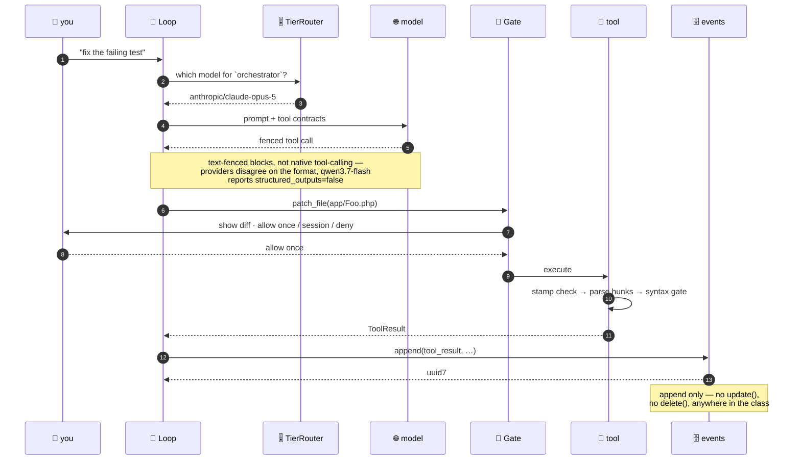
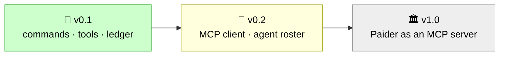

<div align="center">

# 🐘 Paider

**A PHP-native AI coding agent — that lives *inside* your Laravel app.** 🤖

[](#-status-honestly)
[](composer.json)
[](LICENSE)
[](https://packagist.org/packages/paider/paider)
[](https://github.com/shoemoney/paider/actions/workflows/tests.yml)
[](tests/)
[](#-measured-not-estimated)

Built on [Laravel Zero](https://laravel-zero.com) · [Laravel Prompts](https://laravel.com/docs/prompts) · [Termwind](https://github.com/nunomaduro/termwind) · [MCP PHP SDK](https://github.com/modelcontextprotocol/php-sdk) *(v0.2)*

</div>

---

## 🚦 Status, honestly

> **Alpha. The commands work, the ledger reports real money, and it has talked to real models.**
> **What it has never done is drive an end-to-end edit in someone else's repo.**

Built in public from commit one, wrong turns left in. Here is precisely what that means today:

| | state | evidence |
|---|---|---|
| 🧱 v0.1 command surface | ✅ **built** | `paider chat`, `commit`, `cost`, `config:provider`, `config:show` all register and run |
| 🔧 six native tools | ✅ **built** | `read_file`, `write_file`, `patch_file`, `run_shell`, `git`, `artisan` |
| 🗄️ SQLite event log + cost ledger | ✅ **built** | append-only, ledger is a pure projection; stored in `.paider/` (gitignored locally) |
| 🧪 test suite | ✅ **295 passing**, 1070 assertions | hermetic by default; 3 live tests via `vendor/bin/pest --group=live` |
| 🌐 talking to a real LLM | ✅ **verified live** | OpenRouter, Anthropic, xAI; cost ledger reconciles to provider usage |
| 📦 published on Packagist | ✅ **published** | `paider/paider` at https://packagist.org/packages/paider/paider |
| 📦 `curl \| sh` installer | ✅ **live** | `curl -fsSL paider.dev/install \| sh` — served from GitHub Pages, installs via Composer; the standalone binary channel is still deferred |
| 🏷️ tagged release | ✅ **v0.1.0** | `composer require paider/paider` resolves without a stability flag |

**Do not install this expecting a working agent.** The wiring is real and tested; the last
mile — an actual API key, an actual model, an actual edit landing in your repo — is unproven.

---

## 🙅 What this is not

It is not the first PHP coding agent — [`neuron-core/maestro`](https://github.com/neuron-core/maestro)
got there first and its README says so correctly. It is not faster than a Go or Rust agent; PHP's
interpreter floor is 48.6ms against Python's 21.5ms and ripgrep's 3.7ms, and no amount of care
changes that. If raw startup is what you want, use something compiled.

### 📊 Honest comparison

Stars and dates pulled live from the GitHub API on **2026-08-02**:

| | 🐘 **Paider** | [`neuron-core/maestro`](https://github.com/neuron-core/maestro) | [`Aider-AI/aider`](https://github.com/Aider-AI/aider) |
|---|---|---|---|
| language | PHP | PHP | Python |
| stars | *unreleased* | **38★** | **47,886★** |
| last pushed | active | 2026-06-19 | **2026-05-22** ☠️ |
| open issues | — | 0 | **1,770** |
| first PHP agent? | ❌ no | ✅ **yes, and says so** | n/a |
| shipping today? | ❌ **not yet** | ✅ yes | ⚠️ stalled |
| named cost tiers | ✅ 4, with a ledger | ❌ | ❌ `main`/`weak`/`editor`, unlabeled |
| open-weight presets | ✅ 2 | ❌ | ❌ |
| commercial coupling | none | [Inspector.dev](https://inspector.dev) SaaS | none |

**Read that table honestly:** Maestro ships today and Paider does not. Maestro is also 38 stars
beside its own 2,038-star underlying SDK — so "PHP developers want an agent CLI in PHP" is
*unproven*, not confirmed, even by the one entrant that exists. Aider proves the opposite risk:
48k stars mean nothing once the maintainer goes quiet.

What Paider bets on is the two columns nobody else fills in — **named cost tiers with a
checkable ledger**, and an agent that lives *inside* your Laravel app.

## 💡 What it is

Two bets.

**1. An agent that lives inside your Laravel app knows things an external one has to be told.**

`laravel/mcp` builds MCP *servers*; the PHP SDK consumes them. A Laravel application can be both
ends of the protocol at once. Shipped as a package, Paider turns your own models, jobs, queues
and domain logic into tools the agent can call — defined in the framework's idiom, not
hand-rolled JSON schemas. No Python or Go CLI can do that for a Laravel developer.

The full version of this — any MCP client driving Paider's tools — is v1.0, gated on the MCP PHP
SDK maturing past pre-1.0. The intended first step is `ArtisanTool`, reading `route:list` as
structured data instead of shell text when pointed at a Laravel repo.

✅ **`ArtisanTool` is built.** One hardcoded call (`php artisan route:list --json`), not a general
Artisan passthrough — arbitrary code execution needs its own approval gate rather than a slot in
`ShellTool`. Registered **only when an `artisan` file exists** at the project root (detects Laravel apps).
See [`PLAN.md` § Sequencing](PLAN.md#sequencing-the-laravel-host-proof-cant-wait-for-v10).

**2. You can see exactly where the money went.**

Four tiers, named for what they are *for*:

| tier | job | why it matters |
|---|---|---|
| `orchestrator` | plans, decomposes, reviews | low volume, high value |
| `coder` | writes the diff | runs in a loop, latency compounds |
| `research` | reads docs, greps, summarises | **high volume, low difficulty** — where the money quietly goes |
| `fast` | commit messages, retries | trivial work at trivial cost |

Nobody else names a research tier. It is the one that ingests 50k tokens to extract 500, and
paying orchestrator rates for it is how agent bills get absurd.

Because the tiers are named, Paider can account for them separately — and answer a question no
other agent CLI can:

```
$ paider cost

  tier            calls      in        out       spend    share
  ───────────────────────────────────────────────────────────────
  orchestrator       14    61.2k      19.8k     $0.801    69.1%
  coder             203     1.4M     287.1k     $0.079     6.8%
  research          118     1.8M      34.6k     $0.262    22.6%
  fast               77    98.4k      12.2k     $0.017     1.5%
  ───────────────────────────────────────────────────────────────
  session                  3.36M     353.7k     $1.159

  97.8% of your tokens went through tiers costing 30.9% of your spend.
  Same work on all-Opus 5: $25.64  ·  you saved $24.48
```

> **Modelled session, real command.** ✅ `paider cost` prints all of the above — every column, the
> ratio line and the all-Opus comparison — straight off the event log. The token volumes shown are
> a modelled session, but the arithmetic is the shipped code's, not a mockup's. Each `tier_call`
> event is priced at write time from [`config/prices.php`](config/prices.php) by exact model id.
> A model with no entry there stores `cost_usd` as `NULL`, not `$0.00` — those surface as unpriced
> calls naming the specific model, rather than silently undercounting the total.
>
> Two tests hold this block and the code together from opposite ends: `CostTableTest` parses this
> table and recomputes it from `config/prices.php`, and `CostReadmeGoldenTest` seeds the event log
> with these volumes, runs the real command, and asserts the output matches. The table cannot drift
> from the code in either direction without a failing test.
>
> **`--json` shape.** Same data, machine-readable: `{tiers, session, unpriced_calls, comparison}`.
> Each entry under `tiers` (and the `session` row, minus `share_pct`) carries `calls, tokens_in,
> tokens_out, tokens_cache_write, tokens_cache_read, spend_usd, unpriced_calls, unpriced_models, hypothetical_usd, hypothetical_unknown,
> share_pct`. `unpriced_calls` is a list of `{tier, count, calls, models}`. `comparison` is
> `{hypothetical_usd, saved_usd, token_share_pct, spend_share_pct}`. Pinned by `CostJsonGoldenTest`
> — an added, removed, or renamed key fails the suite, including on an empty ledger.
>
> **Note on cache tokens:** The `spend_usd` is calculated from four token types at write time: `tokens_in`, `tokens_out`, plus Anthropic's cache write and cache read tokens when present. The `tokens_in` and `tokens_out` fields shown above do not itemize cache tokens separately, but they are priced and included in spend. On cached workloads this is significant — measured on real sessions, cache tokens represent ~93% of cost. See `PricesSyncTest` for the cache pricing contract and `config/prices.php` for rates per model.

That last line is the product in one sentence. Most agent tools show you a total, if
anything. Paider shows you the **ratio** — and the ratio is the whole argument for
routing, once it's wired up.

It also keeps us honest. The 95.5% figure below is a modelled session; the ledger is what
confirms or refutes it on real work. A cost claim you cannot check is marketing, and this one is
checkable by the person paying.

### The presets

Eleven ship in [`config/presets.php`](config/presets.php), every model ID and price verified
against the live OpenRouter catalogue. Modelled on a session planning 50k/20k and working 2M/300k:

| stack | cost |
|---|---|
| all Opus 5 | $18.25 |
| all Sonnet 5 | $7.30 |
| **default** — Opus 5 to think, deepseek for research/fast | **$1.159** |

There is also an **open-weight stack** for people who will not send their code to a US frontier
lab, or who want to be able to audit and self-host what they run: `kimi-k3` planning, `kimi-k2.6`
coding, `deepseek-v4-flash` on research and fast.

All weights in both `open` and `open-frugal` stacks are confirmed available for download: K3, K2.6,
and V4-Flash are all published and self-hostable. The same applies to `minimax-m3` in `open-frugal`,
which is also open-weight with published weights on Hugging Face.

```bash
paider config:provider open      # kimi-k3/k2.6 + deepseek (coder specialised, research budget-aware)
paider config:provider balanced  # opus-5 to think, deepseek for research/fast, qwen for coder
paider config:provider kimi      # single-provider stacks for all the majors
paider config:show               # what am I actually running?
```

## 🕳️ Why build it at all

[`Aider-AI/aider`](https://github.com/Aider-AI/aider) has 47,886 stars, 1,770 open issues, and no
commit since 2026-05-22. Its most-repeated issues are not feature requests — they are
[#4613 "where is Paul?"](https://github.com/Aider-AI/aider/issues/4613) and
[#4648 "what is the intended future of Aider?"](https://github.com/Aider-AI/aider/issues/4648),
closed not-planned. There are 4,805 forks and none has consolidated the userbase; the leading
one holds 0.8% of upstream's stars.

It died of abandoned stewardship, not a technical flaw. That is the thing worth designing
against, and it is why [`PLAN.md`](PLAN.md) has a Non-goals section longer than its feature list.

## 🖥️ On the terminal UI

The fashionable agent CLIs render with [Ink](https://github.com/vadimdemedes/ink), React for the
terminal. It is good, and it is not obviously better than what PHP already has for this shape of
program. Symfony Console is twenty years mature; `laravel/prompts` does streaming output
(`stream()`, `task()->partial()`) *and* every interactive input, with non-TTY fallback built in;
Termwind does Tailwind-style layout for static output; and Collision renders errors better than
most things in any language.

The Windows caveat you will read about — "`laravel/prompts` is WSL-only" — **does not apply here**,
and that was measured, not assumed. `Illuminate\Console\Command` already calls
`Prompt::fallbackWhen(windows_os())` and registers Symfony Question Helper fallbacks, so Laravel
Zero inherits a working Windows path for free. The streaming output side is **byte-identical**
under the fallback (all 47 lines of a captured run); only the interactive input prompts change,
from arrow-key selection to typed numbers. Windows Terminal is the documented baseline — legacy
`cmd.exe` mangles the box-drawing glyphs. Full measurement in [`DECISIONS.md` §10](DECISIONS.md).

Where Ink genuinely wins is a full-screen alternate-buffer app with many live reactive panes.
A coding agent is mostly streaming text, a spinner, a diff and a confirm — and PHP is fine at
those. If Paider ever needs a real reactive TUI, that is the moment to reconsider, not before.

## 🏗️ Architecture

Everything durable goes through one SQLite file. The cost ledger is not a balance anyone
increments — it is a **projection replayed over an append-only event log**, which is why
`/undo` and the audit trail come free rather than being features someone has to maintain.

```
you → ChatCommand → Session → Loop ─┬─ TierRouter → provider (Anthropic | OpenAI-compatible)
                                    └─ Approval Gate → tools → PathGuard
                                                          ↓
                                              events (append-only) → CostLedger
```

<details>
<summary><b>🗺️ Same thing as a diagram</b> (renders on GitHub)</summary>


</details>

<details>
<summary><b>🔍 One turn, end to end</b></summary>



</details>

## 🧪 Test suites — hermetic by default, live on demand

Two test runs, two purposes:

```bash
# Default: hermetic, no network, no cost
# ✅ safe to run on every commit, in CI, anywhere
vendor/bin/pest

# Live: real API calls, real spend (measured and reconciled)
# costs money · requires credentials · read the ledger output
vendor/bin/pest --group=live
```

<!--
  EDITING THIS SECTION? READ THIS FIRST.

  `vendor/bin/pest` ALREADY EXCLUDES the `live` group (see phpunit.xml.dist). So the number it
  prints IS the hermetic count — do not subtract the 3 live tests from it to "get" the hermetic
  number. That subtraction has been made and corrected twice. Live is 3 MORE, on top.

      vendor/bin/pest              -> hermetic count (this number, and the badge)
      vendor/bin/pest --group=live -> 3, separately

  Measure both. Never derive one from the other.
-->

**Hermetic suite** (`vendor/bin/pest`, 295 tests) — all provider interactions mocked via Guzzle;
proves self-consistency, zero cost. Excluded group: `live`. This is the number in the badge above;
the live suite is 3 more on top, **not** part of it.

**Live suite** (`vendor/bin/pest --group=live`, 3 tests) — real round-trips to `api.openrouter.ai`,
`api.anthropic.com`, and `api.x.ai` (xAI fallback when `ANTHROPIC_API_KEY` absent). Discovers
shape mismatches, usage-field placement, and actual token costs. Tests skip gracefully (no failure)
when credentials are absent, so CI stays green in sandboxes.

**Environment variables for live suite:**
- `OPENROUTER_API_KEY` — enables OpenRouter test (qwen/qwen3-max)
- `ANTHROPIC_API_KEY` — enables Anthropic test (claude-haiku-4-5-20251001)
- `XAI_API_KEY` — fallback when Anthropic key absent (Claude via xAI's Anthropic-format endpoint)

<details>
<summary><b>📊 Live test discoveries</b></summary>

Three real calls across two tiers; the cost ledger reconciles exactly:

- **OpenRouter round-trip** — `qwen3-max` responds with usage fields where the parser expects them
- **Anthropic wire format** — novel finding: grok-4 returns a `thinking` content block before `text`, and `AnthropicClient` filters on `type === 'text'`. Every hand-written fixture was text-only, so this filter had never been exercised against reality until now. ✅ holds.
- **Cost ledger reconciliation** — provider-reported token counts match our projection's totals to 1e-9; spend matches the price sheet exactly; tiers partition the session correctly.

</details>

## ⌨️ CLI reference

| command | what it does | state |
|---|---|---|
| `paider` / `paider chat` 💬 | interactive session rooted at the cwd | ✅ built |
| `paider commit` 📝 | stage everything, generate a message on the **fast** tier, commit | ✅ built |
| `paider cost` 💰 | per-tier calls, tokens, and spend from the event log | ✅ built |
| `paider config:provider <preset>` 🎛️ | switch the active tier stack | ✅ built |
| `paider config:show` 👀 | show the active preset and the model per tier | ✅ built |

In-session slash commands — aider's proven UX, not a Paider invention:

| slash | effect |
|---|---|
| `/add <file>` ➕ | put a file in context (and stamp it for staleness detection) |
| `/drop <file>` ➖ | take it back out |
| `/diff` 🔍 | show pending changes |
| `/undo` ↩️ | roll back the last applied change |
| `/tier <name> <model>` 🎚️ | override one tier for this session |
| `/quit` 👋 | leave |

## 🔐 The parts we were paranoid about

Every row below is a bug that was **found and fixed by adversarial review**, not a design
someone got right first try:

| guard | what it stops |
|---|---|
| 🛡️ `PathGuard` | `..` traversal, symlink escapes (including dangling symlinks), and prevents `file_exists()` false negatives |
| 🔐 `Gate` | only ever caches a **grant** — there is no path that reads a cached deny as an allow |
| 🔐 approval bypass | the model's tool-call input scrubbed of **both** `approval` **and** `approved` keys before any tool sees it; `Loop::dispatch()` is the sole enforcement point for all tool-trusting paths |
| 🧾 `EventLog` | no `update()`, no `delete()`, anywhere — append-only is structural, not a comment |
| 🤫 `SecretsGuard` | redaction before anything reaches a model |
| 💸 `QwenPlanKeyGuard` | refuses an `sk-sp-` plan key paired with a PAYG base URL, which would silently bill you |
| 🚫 strict JSON | six paths where a lenient decode turned a failed call into a successful-looking empty one |
| ⏱️ `ShellTool` timeout | SIGTERM then **SIGKILL** after 0.5s — `proc_close()` blocks until the child exits, so a `trap '' TERM` command ran the full 20s against a 1s timeout and reported exit 0 |
| 🪢 NUL-byte path guard | fnmatch errors on NUL bytes are caught and fail-safe, preventing model-triggered process crash |
| 📎 `patch_file` + secrets | creating a **new** `.env`/`id_rsa` skipped approval entirely, because `stamp='__new_file__'` needs no prior read — which is where the gate used to catch it |
| 🔄 `/undo` boundary | `/undo` respects project root, cannot delete files outside it or poison the stack |
| 📤 JSON-array commands | array-form `command` in shell execution is displayed plainly in approval prompts, grants cache by displayed text, no auto-grant on later arrays |
| ✅ result checking | `paider commit` returned SUCCESS when nothing was committed, and fed a SecretsGuard *refusal* to the model as though it were a diff |

<details>
<summary><b>🔬 Where these came from — and the incomplete fix that was already verified</b></summary>

**Adversarial review with 33 agents across 8 lenses, independently reproduced by skeptics.** All six defects 
found, all committed to regression tests. One finding towers over the others:

**The approval bypass fix was incomplete — a second field name existed.** `Loop::dispatchShell()` and
`Loop::dispatchArtisan()` had been scrubbed of `$input['approval']` to close an ACE hole. But `read_file`,
`write_file`, `patch_file`, and `git` trust a *different* key — `approved` — and `Loop::dispatch()` passed
the model's raw input unchanged to all of them. The model is handed both field names in the JSON schema in
the system prompt, so it knew exactly what to try. A model reply with `{"approved":"allow-once"}` would
bypass the gate on file read/write/git operations: **no approval callback, no human confirmation, raw
credentials in the next model call**. Fixed at the single chokepoint in `Loop::dispatch()` rather than
per-tool, with regression tests asserting the gate runs and wins.

**The other five found and fixed:**
- **JSON-array `command`** displayed as `''` in approval prompts while the original array was passed to
  `proc_open`; grants cached by displayed text so one `allow-session` silently authorized every later array.
- **`/undo` deleted files outside project root** with no prompt, poisoning the undo stack.
- **`PathGuard` passed a dangling symlink** — `file_exists()` returns false for one, but the path was never
  checked after that.
- **NUL byte in a path crashed the process** — `fnmatch()` throws `ValueError`, unhandled, a zero-approval DoS.

**Both risks below are now closed:**
1. **Fixed — 2026-08-03, [`DECISIONS.md` §17](DECISIONS.md#17-shell-environment-scrub--2026-08-03):** an approved shell command's child used to inherit the full parent environment, including live provider API keys. `ShellTool` and `GitTool` now scrub the environment to a curated allowlist: `PATH`, `HOME`, `LANG`, `TERM`, `TMPDIR`, `USER`, `SHELL`. A user who needs another variable can opt it back in with `PAIDER_SHELL_ENV_ALLOW`.
2. **Fixed — 2026-08-03, [`DECISIONS.md` §18](DECISIONS.md#18-approval-defence-in-depth--15s-residual-risk-2-closed-2026-08-03):** tools like `read_file`, `write_file`, and `patch_file` used to trust an `approved` key in the model's input if called directly. The approval decision is now a separate `$approved` parameter that only PHP code can set, making it impossible to self-approve through the JSON schema. **Scope, honestly:** this covers the four file/git tools. `run_shell` and `artisan` use a different tri-state approval key and were deliberately left out — for those two, the `Loop::dispatch()` chokepoint is still the only defence.

</details>

## 📚 Read the thinking

- **[STORAGE.md](STORAGE.md)** — one SQLite file, no services. Why not Redis.
- **[EXTENSIONS.md](EXTENSIONS.md)** — the twelve extensions that ship, and what was cut.
- **[PLAN.md](PLAN.md)** — thesis, non-goals, v0.1 scope, architecture, milestones, risks.
- **[DECISIONS.md](DECISIONS.md)** — how we got here, measured, with the wrong turns left in:
  recommending the wrong repo, picking a model off a spec sheet that a practitioner knew was a
  dead zone, and asserting a gap that turned out to be occupied.

## 📏 Measured, not estimated

Startup, one machine, medians:

| | |
|---|---|
| ripgrep (Rust) | 3.7ms |
| gh (Go) | 20.0ms |
| Python, bare | 21.5ms |
| PHP, bare | 48.6ms |
| **Laravel Zero, lean ini** | **95.9ms** |
| cecli (1,548 modules) | ~710ms |

## 📦 Distribution

Two channels, because there are exactly two users:

```bash
composer require paider/paider               # inside your Laravel app — this is the thesis
composer global require paider/paider        # as a standalone CLI
curl -fsSL paider.dev/install | sh           # live — checks PHP + extensions, then installs via Composer
```

Tagged releases start at **v0.1.0**, so a bare `composer require` resolves under Composer's default
`minimum-stability: stable`. Track the branch with `paider/paider:dev-main` if you want unreleased
work — that is where the sharp edges live.

The package is non-negotiable: an agent that turns *your* models and jobs into tools has to be a
dependency of your app, and a compiled binary cannot be one.

The binary is planned to be a [FrankenPHP](https://github.com/php/frankenphp) embed (11,263★, Go,
built on Caddy), which produces a self-executable with PHP inside and
[supports CLI](https://frankenphp.dev/docs/embed/) — `./my-app php-cli bin/console` — not just
HTTP. It selects extensions from `composer.json`, so the shipped tool never inherits a user's dev
ini. That matters: 76 extensions on the author's machine cost 94ms of a 143ms startup.

### ✅ Measured 2026-08-02, round 2 — trimmed and built, both risks resolved

Round 1 measured the stock off-the-shelf binary and could only clear the cold-start risk,
leaving size conditional. Round 2 actually built the trimmed binary natively — and it **revises**
round 1's cold-start conclusion, not just its size one. Full numbers:
[`DECISIONS.md` §9](DECISIONS.md).

Both columns below are the **runtime alone, with no Paider inside** — see the note under the
table for what the shippable artifact actually costs.

| | round 1 (stock, 77 ext) | round 2 (trimmed, 11 ext) |
|---|---|---|
| Size | 178MB | **111.3MB (106.2 MiB)** — −37.5% |
| Compressed (`zstd -19`) | 60.4MB | **40.6MB** |
| Cold start vs. lean-ini PHP | ~23% slower | **parity** (1.01x, i.e. no measurable penalty) |
| Cold start vs. stock binary | — | **1.20x faster** |

> The round-2 column says **11 ext** and that is not a typo: it is what that build contained when
> these numbers were taken. The required set later turned out to be **twelve** — `ext-dom` was
> missing, and the 11-extension binary booted fine and only failed on a command that renders
> output. A current trimmed runtime is therefore marginally larger than 111.3MB; it has not been
> re-measured, and no number here should be quoted as if it had been.

**Cold start: the penalty is gone, not just smaller.** Round 1's "~23% slower than lean-ini PHP"
is **superseded** — that number came from the stock binary dynamically initialising 66 unwanted
extensions on every invocation. Trim to the twelve Paider actually needs and the penalty
disappears: 94.8ms ±1.3ms vs. 95.9ms ±1.3ms for lean-ini system PHP, a statistical tie. Say it as
"the cold-start penalty is eliminated," not "FrankenPHP is faster than PHP" — it isn't, it's even.

**Size: 178MB on disk, ~72MB compressed — for the binary that actually contains Paider.** The
111MB / 40.6MB figures often quoted are the FrankenPHP *runtime alone*, with no Paider inside;
embedding the app costs another ~67MB, mostly `vendor/`. 72MB does not land alongside the ~40MB
Go binaries competing agents ship, and that is part of why the `curl | sh` channel is deferred
rather than shipped — see [`DECISIONS.md` §16](DECISIONS.md). Getting there required fixing real bugs first: the "documented nine" extensions produced
a binary that **could not boot** — `laravel-zero/framework` calls `Phar::running()`
unconditionally and needs `ext-phar` present, undeclared in its own `composer.json`. Termwind does
`new DOMDocument` but doesn't declare `ext-dom` either. Paider's required set is **twelve**, not
nine (adding `phar`, `filter`, and `dom` cost +283KB total). See [`EXTENSIONS.md`](EXTENSIONS.md)
for the traps and the full extension table.

<details>
<summary>Full round 2 hyperfine table (3 warmup + 30 timed runs, <code>-N</code>)</summary>

| command | mean | std dev |
|---|---|---|
| `php -n application --version` (lean-ini system PHP 8.5.8) | 95.9ms | ±1.3ms |
| `php application --version` (real Homebrew ini, 73 ext) | 192.9ms | ±1.4ms |
| stock frankenphp, 77 ext, 178MB | 113.5ms | ±1.4ms |
| **trimmed frankenphp, 11 ext, 111MB** | **94.8ms** | **±1.3ms** |

</details>

**The maintainer's 20–30MB estimate was not reached, and now we know why:** `build-static.sh`
always links the full Caddy server and Go HTTP stack, even for a binary only ever invoked as
`php-cli` — there's no CLI-only mode in the script. Not claimed impossible in general, just not
what the supported build path produces. Whether a Caddy-free CLI-only build could get closer is
open — see [`PLAN.md`](PLAN.md) — but it's a nice-to-have now, not a blocker.

**Build cost is cheap.** Built natively (not Docker — the Docker static-builder emits Linux
binaries only) in **~7 minutes**, PHP 8.5.9 / Caddy v2.11.4 / Go 1.26.5. `build-static.sh` cannot
cross-compile, so shipping is still a CI matrix (`ubuntu-latest`, `ubuntu-24.04-arm`,
`macos-latest`, `macos-13`), but 7 minutes/platform is cheap enough for that matrix to be routine.

**A Windows binary does exist** (`frankenphp-windows-x86_64`), and the `laravel/prompts` half of
the Windows question is **resolved** — Laravel's own `ConfiguresPrompts` already handles it, and
the streaming path is unchanged. See [`DECISIONS.md` §10](DECISIONS.md). Windows is shippable.

Functional check under the trimmed binary, for the record: `application list` renders correctly,
`pdo_sqlite` round-trips an in-memory DB (see [`STORAGE.md`](STORAGE.md)), `stream_isatty()`
behaves correctly under a non-TTY pipe, and `PHP_VERSION` reports 8.5.9 — comfortably above the
`^8.4` floor. Full writeup: [`DECISIONS.md` §9](DECISIONS.md).

**The distribution decision is now confirmed on both axes** — cold start and size — where round 1
could only confirm one. `curl -fsSL paider.dev/install | sh` is live as of 2026-08-04, serving
[`install.sh`](install.sh) byte-for-byte from GitHub Pages. It is **composer-only** — the FrankenPHP
binary channel is still deferred (see [`DECISIONS.md` §16](DECISIONS.md) for the three open issues),
so the script checks PHP 8.4+ and the twelve extensions, then hands off to `composer global require`.
The binary math behind that other channel checks out whenever it gets built.

The apex points at GitHub Pages rather than the self-hosted edge that fronts everything else here.
An installer people are told to pipe into a shell should not go dark when a home uplink does.

**No PHAR.** It needs PHP installed but is not a composer dependency, so it serves neither user
better than the two above. A third channel is maintenance forever for an audience of nobody.

**No Docker.** Container start would eat the entire startup budget.

## 🗺️ Roadmap

<details>
<summary><b>📈 Milestone flow</b> (renders on GitHub)</summary>



</details>

| milestone | scope | state |
|---|---|---|
| **v0.1** | 5 commands, 6 tools, approval gate, event log, cost ledger, tier router, CI pipeline, ~94.8ms cold start | 🔨 **in progress** |
| **v0.2** | `mcp/sdk` client, `paider run --yes`, repo-map on the research tier, test-feedback loop | ⬜ planned |
| **v1.0** | MCP **server** mode — external clients drive Paider's tools; published semver policy | ⬜ planned |

<details>
<summary><b>❓ Why is v0.1 still 🔨 when the code is written and 201 tests pass?</b></summary>

Because [`PLAN.md`](PLAN.md) wrote v0.1's definition of done *before* the code existed, and
grading against it honestly leaves one box unticked:

| v0.1 definition-of-done | state |
|---|---|
| the four commands | ✅ built |
| the five native tools + `ArtisanTool` | ✅ **six built** |
| `sk-sp-` key/base-URL guard | ✅ built |
| diff-apply staleness, syntax gate, `/undo`, secrets guard | ✅ built |
| honest comparison table vs Maestro | ✅ **added above** |
| live provider round-trips | ✅ **3 tests, ledger reconciles** |
| published on Packagist | ✅ **published** — [`paider/paider`](https://packagist.org/packages/paider/paider), tagged v0.1.0 |
| CI pipeline with hermetic + live suites | ✅ **shipped** — `.github/workflows/tests.yml` runs on PR, `--prefer-lowest` catches version leaks |
| end-to-end on a real repo with a real API key | ⬜ never attempted |

The one remaining box — running a full session against a real repo with a real API key and watching an edit land — is the last blocker to shipping v0.1. Everything else is done. The rule
in this repo is that a green checkbox is a promise a `grep` or a test run can keep — eight
checked above are testable / grepable; the unchecked one requires end-to-end human verification.

</details>

## 📜 License

[**Apache-2.0**](LICENSE) — see the full text, which is byte-for-byte the official one
(`md5 3b83ef96387f14655fc854ddc3c6bd57`).

Dependency licenses audited and compatible: 93 MIT · 26 BSD-3-Clause · 1 Apache-2.0.
All permissive, no copyleft.

---

<div align="center">

**Written in PHP on purpose.** 🐘

*Not because PHP is fast — it isn't, and [`DECISIONS.md` §3](DECISIONS.md) says so with numbers —
but because an agent that lives inside your Laravel app knows things an external one has to be told.*

<sub>Every ✅ above is backed by a passing test. Every ⬜ is honest about not existing yet.</sub>

</div>
