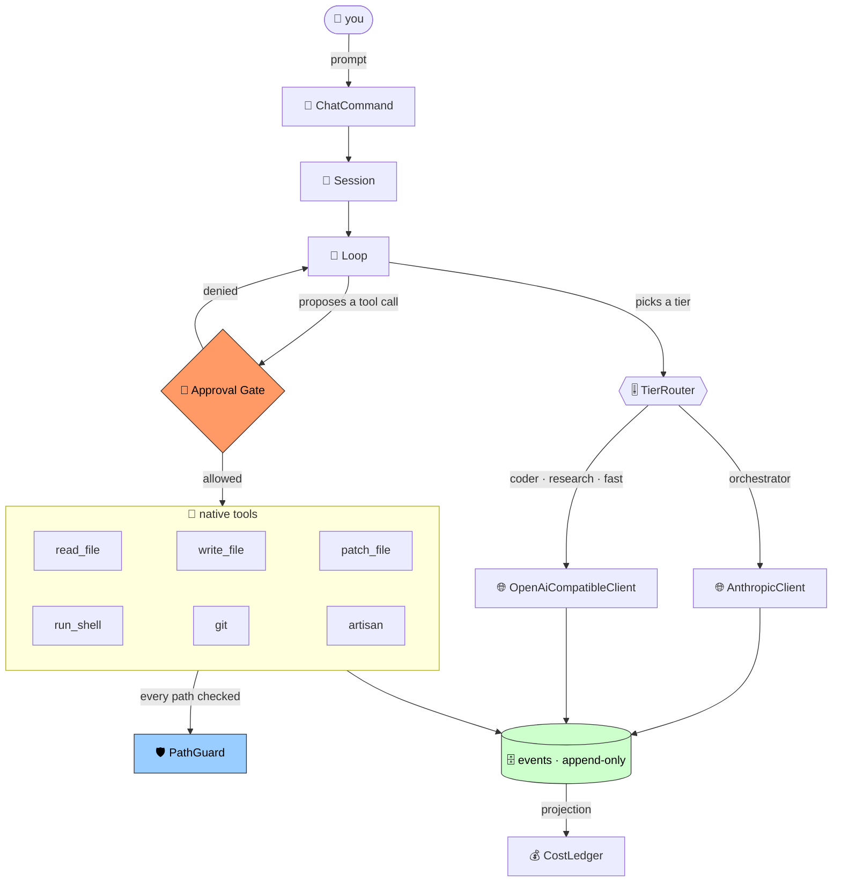
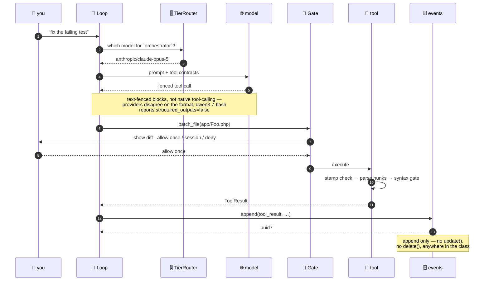
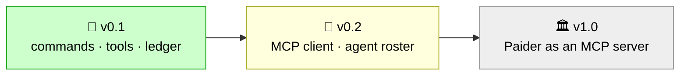

<div align="center">

# 🐘 Paider

**A PHP-native AI coding agent — that lives *inside* your Laravel app.** 🤖

[](#-status-honestly)
[](composer.json)
[](LICENSE)
[](https://packagist.org/packages/paider/paider)
[](tests/)
[](#-measured-not-estimated)

Built on [Laravel Zero](https://laravel-zero.com) · [Laravel Prompts](https://laravel.com/docs/prompts) · [Termwind](https://github.com/nunomaduro/termwind) · [MCP PHP SDK](https://github.com/modelcontextprotocol/php-sdk) *(v0.2)*

</div>

---

## 🚦 Status, honestly

> **Alpha. The v0.1 commands exist and are tested. It has never spoken to a live model.**

Built in public from commit one, wrong turns left in. Here is precisely what that means today:

| | state | evidence |
|---|---|---|
| 🧱 v0.1 command surface | ✅ **built** | `paider chat`, `commit`, `cost`, `config:provider`, `config:show` all register and run |
| 🔧 six native tools | ✅ **built** | `read_file`, `write_file`, `patch_file`, `run_shell`, `git`, `artisan` |
| 🗄️ SQLite event log + cost ledger | ✅ **built** | append-only, ledger is a pure projection; stored in `.paider/` (gitignored locally) |
| 🧪 test suite | ✅ **159 passing**, 525 assertions | hermetic by default; 3 live tests via `vendor/bin/pest --group=live` |
| 🌐 talking to a real LLM | ✅ **verified live** | OpenRouter, Anthropic, xAI; cost ledger reconciles to provider usage |
| 📦 published on Packagist | ✅ **published** | `paider/paider` at https://packagist.org/packages/paider/paider · dev-main only |
| 📦 `curl \| sh` installer | ⬜ **not built** | the binary is measured, the installer is not written |
| 🏷️ tagged release | ⬜ **none** | only dev-main available (no minimum-stability:stable) |

**Do not install this expecting a working agent.** The wiring is real and tested; the last
mile — an actual API key, an actual model, an actual edit landing in your repo — is unproven.

---

## 🙅 What this is not

It is not the first PHP coding agent — [`neuron-core/maestro`](https://github.com/neuron-core/maestro)
got there first and its README says so correctly. It is not faster than a Go or Rust agent; PHP's
interpreter floor is 48.6ms against Python's 21.5ms and ripgrep's 3.7ms, and no amount of care
changes that. If raw startup is what you want, use something compiled.

### 📊 Honest comparison

Stars and dates pulled live from the GitHub API on **2026-08-02**:

| | 🐘 **Paider** | [`neuron-core/maestro`](https://github.com/neuron-core/maestro) | [`Aider-AI/aider`](https://github.com/Aider-AI/aider) |
|---|---|---|---|
| language | PHP | PHP | Python |
| stars | *unreleased* | **38★** | **47,886★** |
| last pushed | active | 2026-06-19 | **2026-05-22** ☠️ |
| open issues | — | 0 | **1,770** |
| first PHP agent? | ❌ no | ✅ **yes, and says so** | n/a |
| shipping today? | ❌ **not yet** | ✅ yes | ⚠️ stalled |
| named cost tiers | ✅ 4, with a ledger | ❌ | ❌ `main`/`weak`/`editor`, unlabeled |
| open-weight presets | ✅ 2 | ❌ | ❌ |
| commercial coupling | none | [Inspector.dev](https://inspector.dev) SaaS | none |

**Read that table honestly:** Maestro ships today and Paider does not. Maestro is also 38 stars
beside its own 2,038-star underlying SDK — so "PHP developers want an agent CLI in PHP" is
*unproven*, not confirmed, even by the one entrant that exists. Aider proves the opposite risk:
48k stars mean nothing once the maintainer goes quiet.

What Paider bets on is the two columns nobody else fills in — **named cost tiers with a
checkable ledger**, and an agent that lives *inside* your Laravel app.

## 💡 What it is

Two bets.

**1. An agent that lives inside your Laravel app knows things an external one has to be told.**

`laravel/mcp` builds MCP *servers*; the PHP SDK consumes them. A Laravel application can be both
ends of the protocol at once. Shipped as a package, Paider turns your own models, jobs, queues
and domain logic into tools the agent can call — defined in the framework's idiom, not
hand-rolled JSON schemas. No Python or Go CLI can do that for a Laravel developer.

The full version of this — any MCP client driving Paider's tools — is v1.0, gated on the MCP PHP
SDK maturing past pre-1.0. The intended first step is `ArtisanTool`, reading `route:list` as
structured data instead of shell text when pointed at a Laravel repo.

✅ **`ArtisanTool` is built.** One hardcoded call (`php artisan route:list --json`), not a general
Artisan passthrough — arbitrary code execution needs its own approval gate rather than a slot in
`ShellTool`. Registered **only when an `artisan` file exists** at the project root (detects Laravel apps).
See [`PLAN.md` § Sequencing](PLAN.md#sequencing-the-laravel-host-proof-cant-wait-for-v10).

**2. You can see exactly where the money went.**

Four tiers, named for what they are *for*:

| tier | job | why it matters |
|---|---|---|
| `orchestrator` | plans, decomposes, reviews | low volume, high value |
| `coder` | writes the diff | runs in a loop, latency compounds |
| `research` | reads docs, greps, summarises | **high volume, low difficulty** — where the money quietly goes |
| `fast` | commit messages, retries | trivial work at trivial cost |

Nobody else names a research tier. It is the one that ingests 50k tokens to extract 500, and
paying orchestrator rates for it is how agent bills get absurd.

Because the tiers are named, Paider can account for them separately — and answer a question no
other agent CLI can:

```
$ paider cost

  tier            calls      in        out       spend    share
  ───────────────────────────────────────────────────────────────
  orchestrator       14    61.2k      19.8k     $0.801    84.9%
  coder             203     1.4M     287.1k     $0.079     8.4%
  research          118     1.8M      34.6k     $0.058     6.2%
  fast               77    98.4k      12.2k     $0.005     0.5%
  ───────────────────────────────────────────────────────────────
  session                  3.36M     353.7k     $0.943

  97.8% of your tokens went through tiers costing 15.1% of your spend.
  Same work on all-Opus 5: $25.64  ·  you saved $24.70
```

> **Modelled session.** `paider cost` ships today and reads this straight off the event log, but
> it prints only `tier | calls | tokens in | tokens out | spend` — the `share` column, the ratio
> line, and the all-Opus comparison above are design, not built. `spend` itself is real: each
> `tier_call` event is priced at write time from [`config/prices.php`](config/prices.php) by exact
> model id. A model with no entry there stores `cost_usd` as `NULL`, not `$0.00` — the command
> reports those separately as unpriced calls, naming the specific model, instead of silently
> undercounting the total.

That last line is the product the design is aiming at. Most agent tools show you a total, if
anything. Paider is meant to show you the **ratio** — and the ratio is the whole argument for
routing, once it's wired up.

It also keeps us honest. The 95.3% figure below is a modelled session; the ledger is what
confirms or refutes it on real work. A cost claim you cannot check is marketing, and this one is
checkable by the person paying.

### The presets

Eleven ship in [`config/presets.php`](config/presets.php), every model ID and price verified
against the live OpenRouter catalogue. Modelled on a session planning 50k/20k and working 2M/300k:

| stack | cost |
|---|---|
| all Opus 5 | $18.25 |
| all Sonnet 5 | $7.30 |
| **default** — Opus 5 to think, `qwen3.7-flash` to do | **$0.85** |

There is also an **open-weight stack** — `kimi-k3` orchestrating with `qwen3.7-flash` on the
other three tiers, self-hostable end to end, for people who will not send their code to a US
frontier lab. As far as we can tell nobody in PHP ships a preset for them.

```bash
paider config:provider open      # kimi-k3 + qwen3.7-flash, open weights
paider config:provider balanced  # opus-5 to think, qwen3.7-flash to do
paider config:provider kimi      # single-provider stacks for all the majors
paider config:show               # what am I actually running?
```

## 🕳️ Why build it at all

[`Aider-AI/aider`](https://github.com/Aider-AI/aider) has 47,886 stars, 1,770 open issues, and no
commit since 2026-05-22. Its most-repeated issues are not feature requests — they are
[#4613 "where is Paul?"](https://github.com/Aider-AI/aider/issues/4613) and
[#4648 "what is the intended future of Aider?"](https://github.com/Aider-AI/aider/issues/4648),
closed not-planned. There are 4,805 forks and none has consolidated the userbase; the leading
one holds 0.8% of upstream's stars.

It died of abandoned stewardship, not a technical flaw. That is the thing worth designing
against, and it is why [`PLAN.md`](PLAN.md) has a Non-goals section longer than its feature list.

## 🖥️ On the terminal UI

The fashionable agent CLIs render with [Ink](https://github.com/vadimdemedes/ink), React for the
terminal. It is good, and it is not obviously better than what PHP already has for this shape of
program. Symfony Console is twenty years mature; `laravel/prompts` does streaming output
(`stream()`, `task()->partial()`) *and* every interactive input, with non-TTY fallback built in;
Termwind does Tailwind-style layout for static output; and Collision renders errors better than
most things in any language.

The Windows caveat you will read about — "`laravel/prompts` is WSL-only" — **does not apply here**,
and that was measured, not assumed. `Illuminate\Console\Command` already calls
`Prompt::fallbackWhen(windows_os())` and registers Symfony Question Helper fallbacks, so Laravel
Zero inherits a working Windows path for free. The streaming output side is **byte-identical**
under the fallback (all 47 lines of a captured run); only the interactive input prompts change,
from arrow-key selection to typed numbers. Windows Terminal is the documented baseline — legacy
`cmd.exe` mangles the box-drawing glyphs. Full measurement in [`DECISIONS.md` §10](DECISIONS.md).

Where Ink genuinely wins is a full-screen alternate-buffer app with many live reactive panes.
A coding agent is mostly streaming text, a spinner, a diff and a confirm — and PHP is fine at
those. If Paider ever needs a real reactive TUI, that is the moment to reconsider, not before.

## 🏗️ Architecture

Everything durable goes through one SQLite file. The cost ledger is not a balance anyone
increments — it is a **projection replayed over an append-only event log**, which is why
`/undo` and the audit trail come free rather than being features someone has to maintain.

```
you → ChatCommand → Session → Loop ─┬─ TierRouter → provider (Anthropic | OpenAI-compatible)
                                    └─ Approval Gate → tools → PathGuard
                                                          ↓
                                              events (append-only) → CostLedger
```

<details>
<summary><b>🗺️ Same thing as a diagram</b> (renders on GitHub)</summary>



</details>

<details>
<summary><b>🔍 One turn, end to end</b></summary>



</details>

## 🧪 Test suites — hermetic by default, live on demand

Two test runs, two purposes:

```bash
# Default: hermetic, no network, no cost
# ✅ safe to run on every commit, in CI, anywhere
vendor/bin/pest

# Live: real API calls, real spend (measured and reconciled)
# costs money · requires credentials · read the ledger output
vendor/bin/pest --group=live
```

**Hermetic suite** (`vendor/bin/pest`, 144 tests) — all provider interactions mocked via Guzzle;
proves self-consistency, zero cost. Excluded group: `live`.

**Live suite** (`vendor/bin/pest --group=live`, 3 tests) — real round-trips to `api.openrouter.ai`,
`api.anthropic.com`, and `api.x.ai` (xAI fallback when `ANTHROPIC_API_KEY` absent). Discovers
shape mismatches, usage-field placement, and actual token costs. Tests skip gracefully (no failure)
when credentials are absent, so CI stays green in sandboxes.

**Environment variables for live suite:**
- `OPENROUTER_API_KEY` — enables OpenRouter test (qwen/qwen3-max)
- `ANTHROPIC_API_KEY` — enables Anthropic test (claude-opus-5-latest)
- `XAI_API_KEY` — fallback when Anthropic key absent (Claude via xAI's Anthropic-format endpoint)

<details>
<summary><b>📊 Live test discoveries</b></summary>

Three real calls across two tiers; the cost ledger reconciles exactly:

- **OpenRouter round-trip** — `qwen3-max` responds with usage fields where the parser expects them
- **Anthropic wire format** — novel finding: grok-4 returns a `thinking` content block before `text`, and `AnthropicClient` filters on `type === 'text'`. Every hand-written fixture was text-only, so this filter had never been exercised against reality until now. ✅ holds.
- **Cost ledger reconciliation** — provider-reported token counts match our projection's totals to 1e-9; spend matches the price sheet exactly; tiers partition the session correctly.

</details>

## ⌨️ CLI reference

| command | what it does | state |
|---|---|---|
| `paider` / `paider chat` 💬 | interactive session rooted at the cwd | ✅ built |
| `paider commit` 📝 | stage everything, generate a message on the **fast** tier, commit | ✅ built |
| `paider cost` 💰 | per-tier calls, tokens, and spend from the event log | ✅ built |
| `paider config:provider <preset>` 🎛️ | switch the active tier stack | ✅ built |
| `paider config:show` 👀 | show the active preset and the model per tier | ✅ built |

In-session slash commands — aider's proven UX, not a Paider invention:

| slash | effect |
|---|---|
| `/add <file>` ➕ | put a file in context (and stamp it for staleness detection) |
| `/drop <file>` ➖ | take it back out |
| `/diff` 🔍 | show pending changes |
| `/undo` ↩️ | roll back the last applied change |
| `/tier <name> <model>` 🎚️ | override one tier for this session |
| `/quit` 👋 | leave |

## 🔐 The parts we were paranoid about

Every row below is a bug that was **found and fixed by adversarial review**, not a design
someone got right first try:

| guard | what it stops |
|---|---|
| 🛡️ `PathGuard` | `..` traversal in a non-existent tail **and** an existing intermediate dir symlinked out of the project |
| 🔐 `Gate` | only ever caches a **grant** — there is no path that reads a cached deny as an allow |
| 🔐 approval bypass | the model's own tool-call input **never** contains the `approval` key — `Loop` deletes it before the gate runs, so a model trying `{"approval":"allow-once"}` cannot self-approve |
| 🧾 `EventLog` | no `update()`, no `delete()`, anywhere — append-only is structural, not a comment |
| 🤫 `SecretsGuard` | redaction before anything reaches a model |
| 💸 `QwenPlanKeyGuard` | refuses an `sk-sp-` plan key paired with a PAYG base URL, which would silently bill you |
| 🚫 strict JSON | six paths where a lenient decode turned a failed call into a successful-looking empty one |
| ⏱️ `ShellTool` timeout | SIGTERM then **SIGKILL** after 0.5s — `proc_close()` blocks until the child exits, so a `trap '' TERM` command ran the full 20s against a 1s timeout and reported exit 0 |
| 📎 `patch_file` + secrets | creating a **new** `.env`/`id_rsa` skipped approval entirely, because `stamp='__new_file__'` needs no prior read — which is where the gate used to catch it |
| ✅ result checking | `paider commit` returned SUCCESS when nothing was committed, and fed a SecretsGuard *refusal* to the model as though it were a diff |

<details>
<summary><b>🔬 Where these came from</b></summary>

Every row above was found by an **adversarial review pass that read the code on disk rather
than the author's summary**, then re-verified against the committed result. Three are worth
calling out because the tests were green the whole time:

- **Approval gate bypass (critical).** `Loop::dispatchArtisan()` and `Loop::dispatchShell()` passed the model's own tool-call input straight through to the tool without scrubbing. If that input contained `{"approval": "yes"}`, it bypassed the gate entirely — the approval callback never ran. `ArtisanTool` accepts any non-`deny` value, and `Loop::systemInstruction()` JSON-encodes the tool's `inputSchema()` into the prompt, so the model was explicitly told the field name and values. A model reply of `{"name":"artisan","input":{"approval":"allow-once"}}` would run service providers with zero human approval: **arbitrary code execution**. Fixed by `unset($input['approval'])` in both dispatchers before the gate. Two regression tests now assert the gate runs and its answer wins when a model tries to self-approve.
- **`/add` was silently inert.** `Loop` never read `Session::contextFiles()`, so added files
  never reached the model — and without their sha256 the model could not supply the stamp
  `patch_file` requires. The headline workflow did nothing, with no error.
- **`PathGuard` had two independent escapes**, found by two different reviewers. The first was
  `..` in a non-existent tail. The second was an *existing* intermediate directory symlinked
  out of the project, which the first fix said nothing about.

</details>

## 📚 Read the thinking

- **[STORAGE.md](STORAGE.md)** — one SQLite file, no services. Why not Redis.
- **[EXTENSIONS.md](EXTENSIONS.md)** — the eleven extensions that ship, and what was cut.
- **[PLAN.md](PLAN.md)** — thesis, non-goals, v0.1 scope, architecture, milestones, risks.
- **[DECISIONS.md](DECISIONS.md)** — how we got here, measured, with the wrong turns left in:
  recommending the wrong repo, picking a model off a spec sheet that a practitioner knew was a
  dead zone, and asserting a gap that turned out to be occupied.

## 📏 Measured, not estimated

Startup, one machine, medians:

| | |
|---|---|
| ripgrep (Rust) | 3.7ms |
| gh (Go) | 20.0ms |
| Python, bare | 21.5ms |
| PHP, bare | 48.6ms |
| **Laravel Zero, lean ini** | **95.9ms** |
| cecli (1,548 modules) | ~710ms |

## 📦 Distribution

Two channels, because there are exactly two users:

```bash
composer require paider/paider:dev-main      # inside your Laravel app — this is the thesis
curl -fsSL paider.dev/install | sh           # planned: standalone binary, not built yet
```

**Why `:dev-main`?** Paider is published on [Packagist](https://packagist.org/packages/paider/paider)
but has no tagged releases yet — only the dev branch (`dev-main`) is available. Composer's default
minimum-stability is `stable`, which means a bare `composer require paider/paider` will fail to
resolve. Use `paider/paider:dev-main` until the first tagged release ships.

The package is non-negotiable: an agent that turns *your* models and jobs into tools has to be a
dependency of your app, and a compiled binary cannot be one.

The binary is planned to be a [FrankenPHP](https://github.com/php/frankenphp) embed (11,263★, Go,
built on Caddy), which produces a self-executable with PHP inside and
[supports CLI](https://frankenphp.dev/docs/embed/) — `./my-app php-cli bin/console` — not just
HTTP. It selects extensions from `composer.json`, so the shipped tool never inherits a user's dev
ini. That matters: 76 extensions on the author's machine cost 94ms of a 143ms startup.

### ✅ Measured 2026-08-02, round 2 — trimmed and built, both risks resolved

Round 1 measured the stock off-the-shelf binary and could only clear the cold-start risk,
leaving size conditional. Round 2 actually built the trimmed binary natively — and it **revises**
round 1's cold-start conclusion, not just its size one. Full numbers:
[`DECISIONS.md` §9](DECISIONS.md).

| | round 1 (stock, 77 ext) | round 2 (trimmed, 11 ext) |
|---|---|---|
| Size | 178MB | **111.3MB (106.2 MiB)** — −37.5% |
| Compressed (`zstd -19`) | 60.4MB | **40.6MB** |
| Cold start vs. lean-ini PHP | ~23% slower | **parity** (1.01x, i.e. no measurable penalty) |
| Cold start vs. stock binary | — | **1.20x faster** |

**Cold start: the penalty is gone, not just smaller.** Round 1's "~23% slower than lean-ini PHP"
is **superseded** — that number came from the stock binary dynamically initialising 66 unwanted
extensions on every invocation. Trim to the eleven Paider actually needs and the penalty
disappears: 94.8ms ±1.3ms vs. 95.9ms ±1.3ms for lean-ini system PHP, a statistical tie. Say it as
"the cold-start penalty is eliminated," not "FrankenPHP is faster than PHP" — it isn't, it's even.

**Size: 111MB on disk, honestly stated — but 40.6MB is what an installer downloads.** That lands
right alongside the ~40MB Go binaries competing agents ship, which makes the `curl | sh` story
viable. Getting there required fixing a real bug first: the "documented nine" extensions produced
a binary that **could not boot** — `laravel-zero/framework` calls `Phar::running()`
unconditionally and needs `ext-phar` present, undeclared in its own `composer.json`. Paider's
required set is **eleven**, not nine (adding `phar` and `filter` cost +283KB). See
[`EXTENSIONS.md`](EXTENSIONS.md) for the trap and the full extension table.

<details>
<summary>Full round 2 hyperfine table (3 warmup + 30 timed runs, <code>-N</code>)</summary>

| command | mean | std dev |
|---|---|---|
| `php -n application --version` (lean-ini system PHP 8.5.8) | 95.9ms | ±1.3ms |
| `php application --version` (real Homebrew ini, 73 ext) | 192.9ms | ±1.4ms |
| stock frankenphp, 77 ext, 178MB | 113.5ms | ±1.4ms |
| **trimmed frankenphp, 11 ext, 111MB** | **94.8ms** | **±1.3ms** |

</details>

**The maintainer's 20–30MB estimate was not reached, and now we know why:** `build-static.sh`
always links the full Caddy server and Go HTTP stack, even for a binary only ever invoked as
`php-cli` — there's no CLI-only mode in the script. Not claimed impossible in general, just not
what the supported build path produces. Whether a Caddy-free CLI-only build could get closer is
open — see [`PLAN.md`](PLAN.md) — but it's a nice-to-have now, not a blocker.

**Build cost is cheap.** Built natively (not Docker — the Docker static-builder emits Linux
binaries only) in **~7 minutes**, PHP 8.5.9 / Caddy v2.11.4 / Go 1.26.5. `build-static.sh` cannot
cross-compile, so shipping is still a CI matrix (`ubuntu-latest`, `ubuntu-24.04-arm`,
`macos-latest`, `macos-13`), but 7 minutes/platform is cheap enough for that matrix to be routine.

**A Windows binary does exist** (`frankenphp-windows-x86_64`), and the `laravel/prompts` half of
the Windows question is **resolved** — Laravel's own `ConfiguresPrompts` already handles it, and
the streaming path is unchanged. See [`DECISIONS.md` §10](DECISIONS.md). Windows is shippable.

Functional check under the trimmed binary, for the record: `application list` renders correctly,
`pdo_sqlite` round-trips an in-memory DB (see [`STORAGE.md`](STORAGE.md)), `stream_isatty()`
behaves correctly under a non-TTY pipe, and `PHP_VERSION` reports 8.5.9 — comfortably above the
`^8.4` floor. Full writeup: [`DECISIONS.md` §9](DECISIONS.md).

**The distribution decision is now confirmed on both axes** — cold start and size — where round 1
could only confirm one. `curl -fsSL paider.dev/install | sh` above is still **planned**, not
built; the binary math behind it now checks out.

**No PHAR.** It needs PHP installed but is not a composer dependency, so it serves neither user
better than the two above. A third channel is maintenance forever for an audience of nobody.

**No Docker.** Container start would eat the entire startup budget.

## 🗺️ Roadmap

<details>
<summary><b>📈 Milestone flow</b> (renders on GitHub)</summary>



</details>

| milestone | scope | state |
|---|---|---|
| **v0.1** | 5 commands, 6 tools, approval gate, event log, cost ledger, tier router | 🔨 **in progress** |
| **v0.2** | `mcp/sdk` client, `paider run --yes`, repo-map on the research tier, test-feedback loop | ⬜ planned |
| **v1.0** | MCP **server** mode — external clients drive Paider's tools; published semver policy | ⬜ planned |

<details>
<summary><b>❓ Why is v0.1 still 🔨 when the code is written and 155 tests pass?</b></summary>

Because [`PLAN.md`](PLAN.md) wrote v0.1's definition of done *before* the code existed, and
grading against it honestly leaves one box unticked:

| v0.1 definition-of-done | state |
|---|---|
| the four commands | ✅ built |
| the five native tools + `ArtisanTool` | ✅ **six built** |
| `sk-sp-` key/base-URL guard | ✅ built |
| diff-apply staleness, syntax gate, `/undo`, secrets guard | ✅ built |
| honest comparison table vs Maestro | ✅ **added above** |
| live provider round-trips | ✅ **3 tests, ledger reconciles** |
| published on Packagist | ✅ **published** — [`paider/paider`](https://packagist.org/packages/paider/paider) as dev-main |
| end-to-end on a real repo with a real API key | ⬜ never attempted |

The one remaining box — running a full session against a real repo with a real API key and watching an edit land — is the last blocker to shipping v0.1. Everything else is done. The rule
in this repo is that a green checkbox is a promise a `grep` or a test run can keep — seven
checked above are testable / grepable; the unchecked one requires end-to-end human verification.

</details>

## 📜 License

[**Apache-2.0**](LICENSE) — see the full text, which is byte-for-byte the official one
(`md5 3b83ef96387f14655fc854ddc3c6bd57`).

Dependency licenses audited and compatible: 93 MIT · 26 BSD-3-Clause · 1 Apache-2.0.
All permissive, no copyleft.

---

<div align="center">

**Written in PHP on purpose.** 🐘

*Not because PHP is fast — it isn't, and [`DECISIONS.md` §3](DECISIONS.md) says so with numbers —
but because an agent that lives inside your Laravel app knows things an external one has to be told.*

<sub>Every ✅ above is backed by a passing test. Every ⬜ is honest about not existing yet.</sub>

</div>
